# A1 公开提交：刘子源

## 基本信息

- 作业题面版本：26.0.4
- 完成范围：21 个公开 adapter、Tokenizer、Transformer、训练组件、完整训练流水线、TinyStories/OWT 实验、学习率与 batch size 扫描、四项架构消融、文本生成和公开实验报告
- 上游 starter commit：`a158843b20107949f1a8d7df1b05cd33b9166712`

本提交只包含允许公开的源码、轻量配置、脱敏日志和图表。数据集、模型 checkpoint、虚拟环境、内部路径与资源标识均未提交。

## 1. 实现概览

真实实现位于 `submission/cs336_basics/`，`submission/tests/adapters.py` 只负责把官方 ABI 转发给真实实现。

- Tokenizer：先按照 GPT-2 的规则切分文本，然后训练 byte-level BPE。支持特殊标记、文本编码和解码，也可以分块处理较长的文本。
- Transformer：没有直接使用 PyTorch 提供的 Linear 和 Embedding，而是自己实现了词向量、注意力、位置编码、归一化、前馈网络和语言模型输出层。
- 训练：实现了交叉熵、AdamW 和学习率调整。训练时会随机抽取数据、限制过大的梯度、保存训练进度，并记录每一步的 loss 和学习率。
- 文本生成：可以调整生成结果的随机程度、固定随机种子，并在生成结束标记后自动停止。
- 消融实验：分别删除归一化、改变归一化的位置、删除位置编码以及替换前馈网络，用来比较这些组件对模型结果的影响。

核心模块没有调用 `nn.Linear`、`nn.Embedding` 或 `torch.optim.AdamW`。

## 2. 书面题

### 2.1 Unicode 与 UTF-8

`chr(0)` 是 Unicode 码点 U+0000（NUL）。`repr(chr(0))` 显示为 `'\x00'`；直接打印时没有可见字形，但它仍然是一个真实字符。

Unicode 定义抽象码点，UTF-8 定义码点到字节序列的编码。比如：

```python
"牛".encode("utf-8") == b"\xe7\x89\x9b"
"é".encode("utf-8") == b"\xc3\xa9"
```

`é` 的两个字节必须整体解码，逐字节解码会失败。`b"\xc3\x28"` 也是非法 UTF-8，因为 `0xc3` 后需要一个 `10xxxxxx` 形式的 continuation byte，而 `0x28` 不满足。

UTF-8 与 ASCII 兼容，英文通常每字符 1 byte；UTF-32 固定每码点 4 bytes；UTF-16 还涉及 surrogate pair 与字节序。Byte-level tokenizer 的基础词表覆盖 `0..255`，因此任意合法 UTF-8 都不会 OOV；BPE 再把高频字节序列合并为更长 token，以缩短序列。

### 2.2 Transformer 参数量与 FLOPs

对于无 bias、输入 embedding 与 LM head 不共享权重的模型：

```text
P = 2 V d + N (4 d^2 + 3 d d_ff + 2 d) + d
```

其中每层 `4d²` 来自 Q/K/V/O，`3 d d_ff` 来自 SwiGLU 三个矩阵，`2d` 来自两组 RMSNorm，最后一个 `d` 是 final RMSNorm。

单条长度为 `L` 的序列，每层主要 forward FLOPs 为：

```text
8 L d^2 + 4 L^2 d + 6 L d d_ff
```

其中 Q/K/V/O 投影为 `8Ld²`，attention score 与 value aggregation 为 `4L²d`，SwiGLU 的 W1/W2/W3 为 `6Ldd_ff`；模型末端 LM head 另需 `2LdV`。GPT-2 四种规格（`V=50,257`、`L=1,024`）的完整核算如下：

| 模型 | layers / heads | `d_model / d_ff` | 参数量 | float32 参数内存 | forward FLOPs | QKVO | attention | SwiGLU | LM head |
| --- | ---: | ---: | ---: | ---: | ---: | ---: | ---: | ---: | ---: |
| small | 12 / 12 | 768 / 2,048 | 162,148,608 | 0.604 GiB | 0.292 TF | 19.88% | 13.25% | 39.76% | 27.10% |
| medium | 24 / 16 | 1,024 / 2,752 | 406,539,264 | 1.514 GiB | 0.830 TF | 24.83% | 12.42% | 50.05% | 12.70% |
| large | 36 / 20 | 1,280 / 3,456 | 842,438,400 | 3.138 GiB | 1.787 TF | 27.04% | 10.82% | 54.76% | 7.37% |
| XL | 48 / 25 | 1,600 / 4,288 | 1,640,452,800 | 6.111 GiB | 3.517 TF | 28.62% | 9.16% | 57.53% | 4.68% |

模型变大时，SwiGLU 和 dense projections 的占比上升，固定词表 LM head 的占比下降；在 `L=1,024` 时 XL 最耗算力的是 SwiGLU。把 XL 上下文增至 `16,384` 后，一次 forward 从 `3.517 TFLOPs` 增至 `133.578 TFLOPs`（约 38.0 倍），attention 的占比从 9.16% 升至 61.73%，成为主导项；QKVO、SwiGLU、LM head 分别降至 12.06%、24.24%、1.97%。

本实验 TinyStories 模型为 `V=10000, L=256, N=4, d=512, d_ff=1344`，参数量约 `22,696,448`，每条 256-token 序列的 forward 约为 `9.53e9` FLOPs。

### 2.3 AdamW 显存与训练时间

若参数量为 `P`，float32 参数、梯度、AdamW 一阶矩和二阶矩各占 `4P` bytes，因此非激活部分为：

```text
parameter + gradient + m + v = 16P bytes
```

按题面指定的中间量逐项保存，batch 为 `B` 时激活显存近似为：

```text
M_act = 4 B [N(8 L d + 4 L d_ff + 2 h L²) + Ld + 2LV] bytes
```

括号内依次覆盖每层两个 RMSNorm、Q/K/V、attention score、softmax、weighted values、输出投影、SwiGLU 三个线性层及中间门控激活，以及 final RMSNorm、logits 和 cross-entropy 所需 logits 量。因而 `M_peak ≈ 16P + M_act`。代入 GPT-2 XL 得：

```text
M_peak ≈ 26.247 GB + 16.373 GB × B
```

在十进制 80 GB（即使按 80 GiB 也相同）下，最大整数 batch 为 **3**。本作业的 TinyStories 模型仅参数、梯度和 AdamW 状态约占 `346 MiB`；实际运行还会有 CUDA workspace 与 allocator 保留量。

按题面 AdamW 伪代码，weight decay 为 `2P` FLOPs，一阶矩为 `3P`，二阶矩为 `4P`，归一化更新为 `5P`，合计约 `14P` FLOPs/step；相对于 Transformer forward/backward 很小。

训练 FLOPs 常近似为 forward 的 3 倍，因为 backward 约为 forward 的 2 倍。GPT-2 XL 在 H100 TF32 峰值 `495 TFLOP/s`、50% MFU 下，训练 `400,000` steps、batch 1024 的估计时间为约 **4,850 小时（202 天）**。本实验训练 `327,680,000` tokens，理论计算量约 `3.66e16` FLOPs；实测 TinyStories baseline 总墙钟时间为 `3114.9 s`。

### 2.4 SGD toy learning-rate tuning

题面 toy loss 为 `mean(weights²)`，10 步实验中 LR=10 稳定但较慢地下降；LR=100 第一步只改变符号、loss 不变，随后快速降到 0；LR=1000 的第一步就把 loss 放大约 361 倍，之后继续指数式增长，属于明确发散。

## 3. Tokenizer 实验

| 数据/设置 | 结果 |
| --- | ---: |
| TinyStories 10K，8 workers | 115.52 s |
| TinyStories 10K，32 workers | 36.85 s |
| TinyStories 10K，64 workers | 36.16 s |
| TinyStories 64-worker peak RSS | 449,144 KiB（约 438.6 MiB） |
| TinyStories BPE 训练输入吞吐 | 18.39 MiB/s |
| OWT 32K BPE 训练输入吞吐 | 5.41 MiB/s |
| TinyStories 10 文档 / 自身 tokenizer | 4.112 bytes/token |
| OWT 10 文档 / 自身 tokenizer | 4.691 bytes/token |
| OWT 10 文档 / TinyStories tokenizer | 3.189 bytes/token |
| TinyStories 全量编码吞吐 | 6.63 MiB/s |
| OWT 全量编码吞吐 | 9.45 MiB/s |
| TinyStories 最长 token | 15 bytes，` accomplishment` |
| OWT 最长 token | 64 bytes |

64-worker TinyStories 复测的 GNU `time -v` 峰值 RSS 为 449,144 KiB，远低于 30 GB 上限。32 workers 相对 8 workers 已获得约 3.14 倍加速，增加到 64 workers 只再改善约 1.9%。这说明低并行度时预分词最耗时，而到 32 workers 后瓶颈转向 I/O、进程调度和串行 merge。OWT 使用更大的 32K 词表；在同一批 10 个 OWT 文档上，TinyStories tokenizer 产生 9,873 tokens，而 OWT tokenizer 只产生 6,712 tokens，跨域 tokenizer 的压缩率明显变差。OWT 的最长 token 是异常重复字节模式，说明“最长 token”不一定对应有语义的长单词。

按实测全量编码吞吐，处理 825 GB Pile 约需 33.0 小时（TinyStories tokenizer）或 23.1 小时（OWT tokenizer），未计额外 I/O 波动。10K 与 32K 词表的 token id 都小于 65,536，因此训练/验证集序列保存为 `uint16` 正好只需每 token 2 bytes；实验实际生成了 `data/tinystories_{train,valid}.npy` 与 `data/owt_{train,valid}.npy`，这些大文件按提交规则未复制进公开目录。

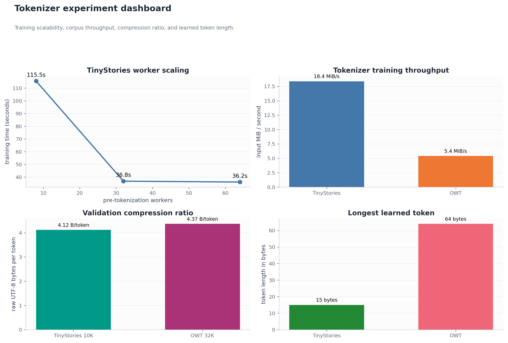

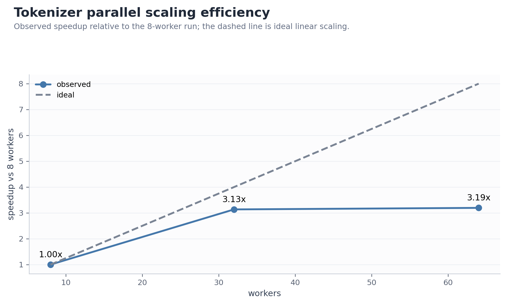

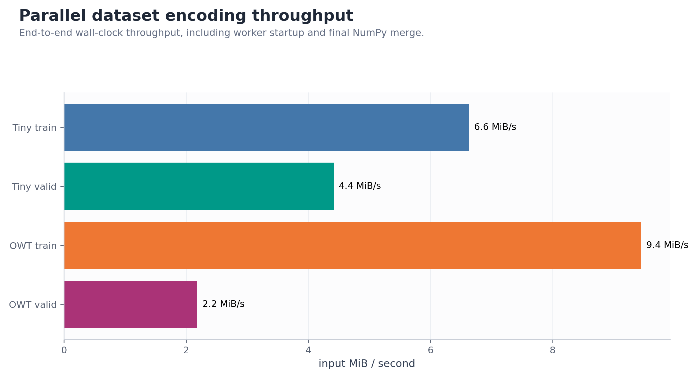

## 4. TinyStories baseline

配置：4 层、`d_model=512`、16 heads、context 256、batch 128、10,000 steps、max LR `5e-4`。

| 指标 | 数值 |
| --- | ---: |
| 最终 validation loss | **1.3826** |
| 最佳 validation loss | **1.3560**（step 9800） |
| 最终 train loss | 1.3421 |
| 总训练时间 | 3114.9 s（51.9 min） |
| 处理 token 数 | 327,680,000 |

训练曲线持续下降且 train/validation 间距较小，最终达到题面 `≤1.45` 的标准目标。

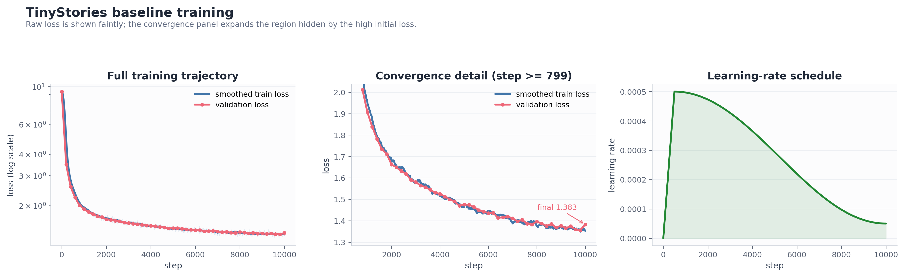

## 5. Learning-rate sweep

所有短跑使用相同模型、batch size、seed 和 2000-step 比较预算；baseline 的 2K 截断值来自完整 run 的相同前缀。

| max LR | 比较端 validation loss | 结论 |
| ---: | ---: | --- |
| `1e-4` | 2.2242 | 过小，学习明显不足 |
| `5e-4` | 1.7113（step 1800） | 稳定、保守 |
| `1e-3` | 1.5396 | 更快收敛 |
| `3e-3` | **1.5037** | 2K 预算内最佳 |
| `1e-2` | 2.0050 | 跨过稳定区，性能显著退化 |
| `1` 探针 | 5.9938（200 steps；峰值 123.01） | 明显失稳 |
| `3` 探针 | 16.5234（200 steps；峰值 296.40） | 发散 |
| `10` 探针 | 125.7650（200 steps；峰值 720.90） | 严重发散 |

`3e-3` 在短预算中最好，但 10K 正式训练选择更保守的 `5e-4`，避免把短跑优势误当成长程稳定性。`1e-2` 已出现明显退化；把峰值 LR 提到 1、3、10 后，loss 很快从初始化约 9.35 上冲到 123、296、721，且最终仍远高于初始化，给出了明确发散边界。这支持“最佳学习率靠近、但必须低于稳定性边缘”的经验规律。

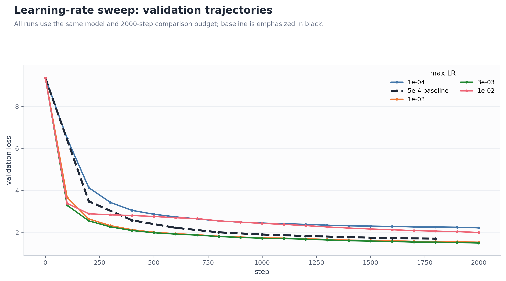

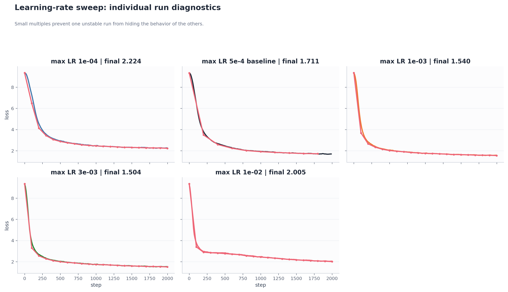

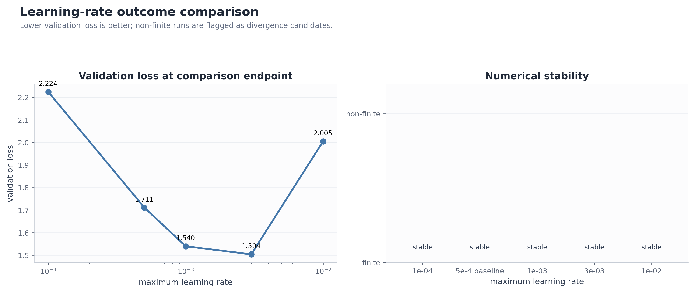

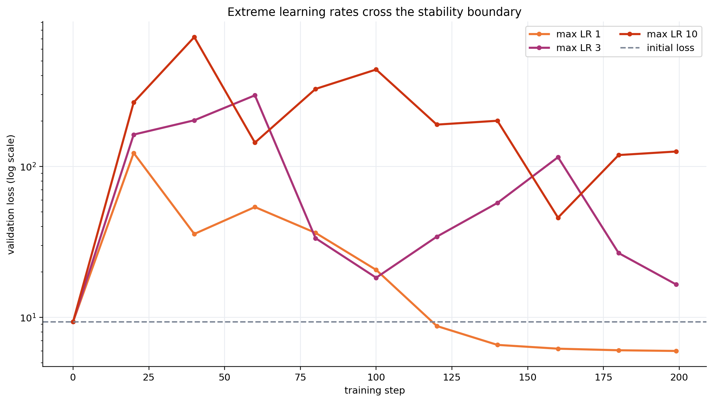

## 6. Batch-size sweep

| batch size | tokens/s | 峰值显存 | 300-step val loss |
| ---: | ---: | ---: | ---: |
| 1 | 5,540 | 0.95 GiB | 4.4018 |
| 16 | 97,186 | 2.66 GiB | 3.3902 |
| 32 | 109,921 | 4.69 GiB | 3.0143 |
| 64 | **111,151** | 8.36 GiB | 2.8648 |
| 128 | 107,844 | 16.10 GiB | 2.7313 |
| 192 | 97,506 | 23.52 GiB | 2.6470 |
| 256 | OOM/失败 | 约 23.1 GiB | 无 |

吞吐量在 batch 64 附近饱和，之后显存与单步耗时继续上升。192 是实测最大可运行 batch，但几乎占满 24 GiB；综合吞吐和余量，64 或 128 更实用。固定 step 比较中大 batch 处理的 token 更多，因此 validation loss 更低；这张表主要用于资源与吞吐分析，不能把它解释为严格等 token 预算下的优化优劣。

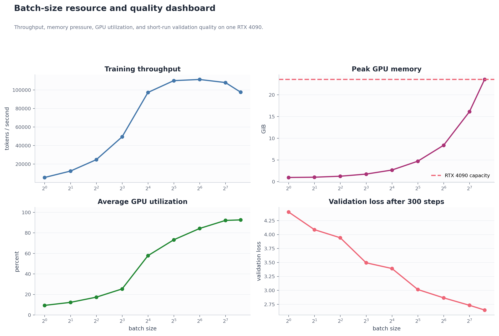

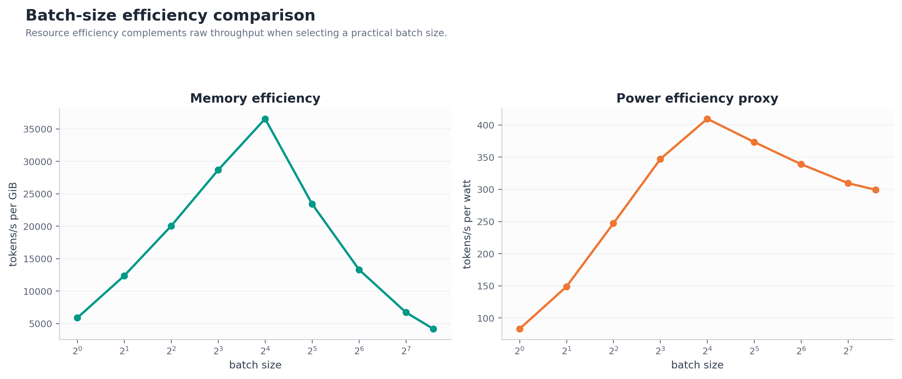

## 7. 架构消融

除消融项外，数据、训练步数、seed 和 scheduler 保持一致。No RMSNorm 同时测试了较低峰值学习率 `2.5e-4` 和 baseline 使用的 `5e-4`；其余消融使用 `5e-4`。两组 No RMSNorm 都完整运行了 10,000 steps，`5e-4` 并未发散，且明显优于较低学习率，因此主表报告 `5e-4` 的结果。

| 模型 | 最终 val loss | 最佳 val loss | 相对 baseline |
| --- | ---: | ---: | ---: |
| Baseline | **1.3826** | **1.3560** | 0 |
| No RMSNorm (`5e-4`) | 1.6327 | 1.6051 | +0.2501 |
| No RMSNorm (`2.5e-4`) | 1.8707 | 1.8391 | +0.4881 |
| Post-Norm | 1.4226 | 1.3954 | +0.0400 |
| NoPE | 1.4518 | 1.4225 | +0.0692 |
| SiLU FFN | 1.4057 | 1.3788 | +0.0231 |

结论：

- RMSNorm 是最关键的质量组件：删除后，`5e-4` 仍稳定完成训练，但最终 validation loss 比 baseline 高 0.2501；把学习率降到 `2.5e-4` 反而进一步恶化到 1.8707。这说明本实验中归一化的主要作用不是避免 `5e-4` 立即发散，而是改善优化轨迹和最终质量。
- Post-Norm 可以训练，但比 Pre-Norm 慢且最终略差，支持 Pre-Norm 更适合当前深度与优化设置。
- NoPE 损失约 0.069，说明即使上下文只有 256，位置信息仍然重要。
- 参数量近似匹配的普通 SiLU FFN 只比 SwiGLU 差约 0.023，差距较小但稳定存在。

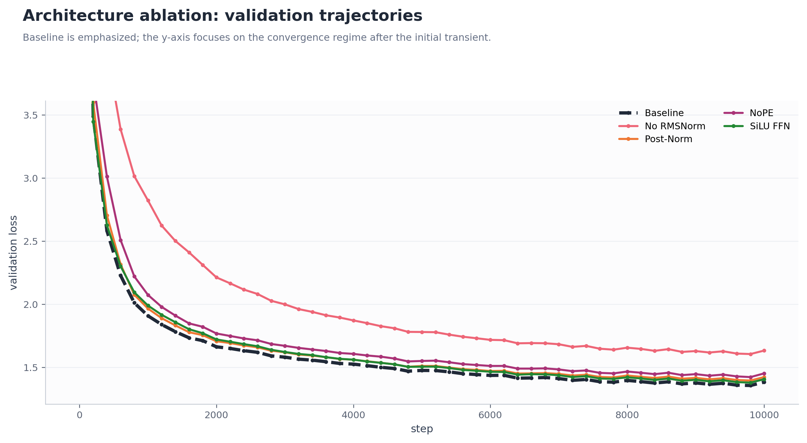

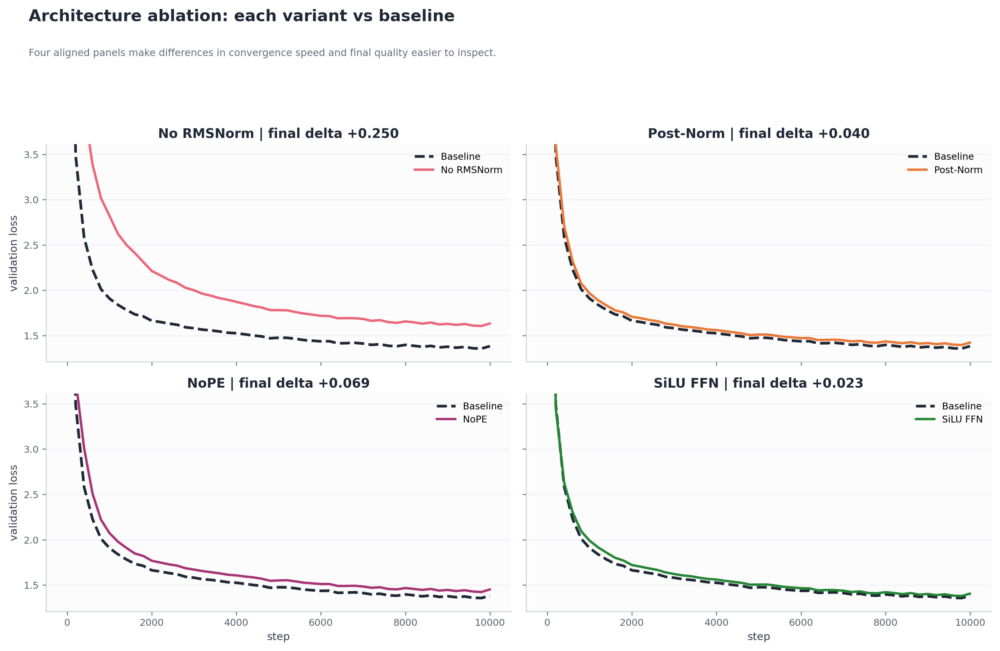

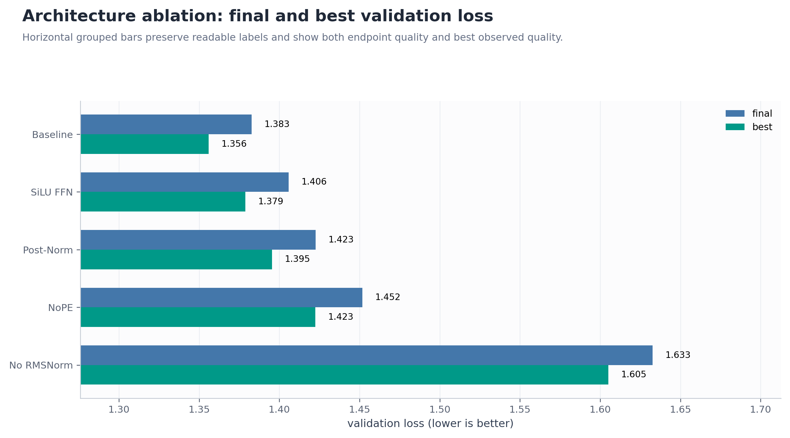

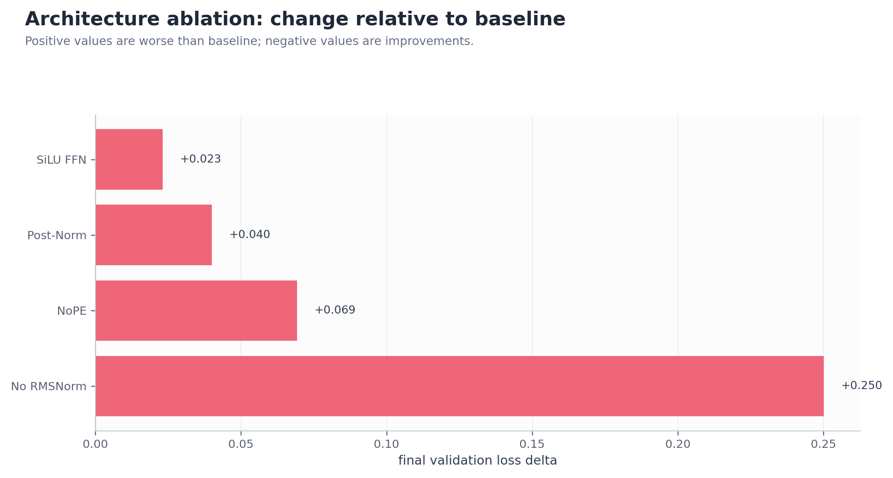

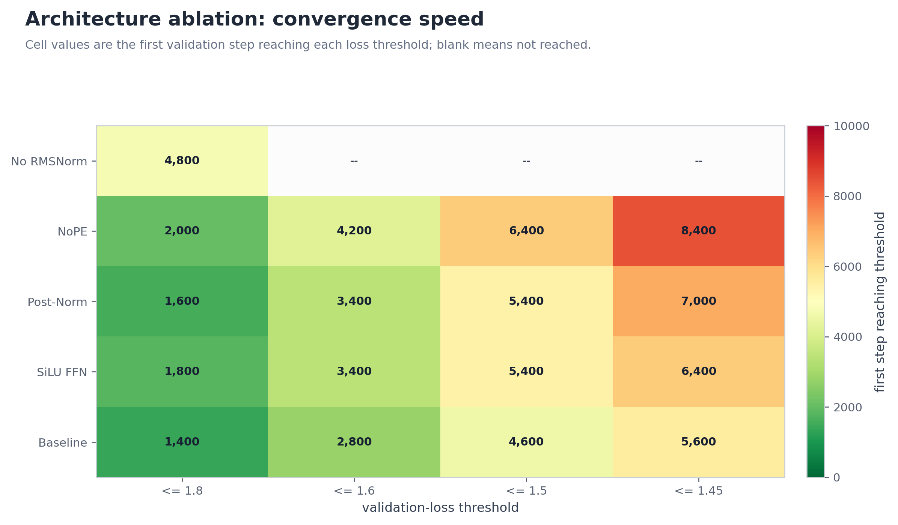

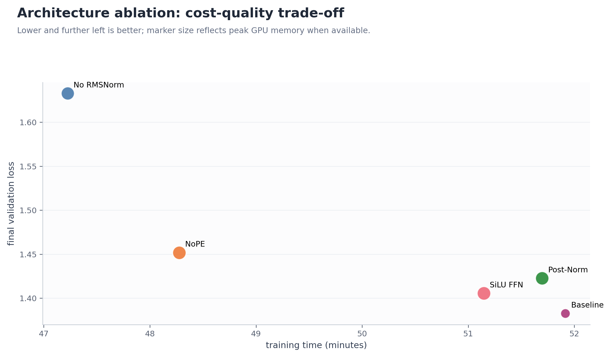

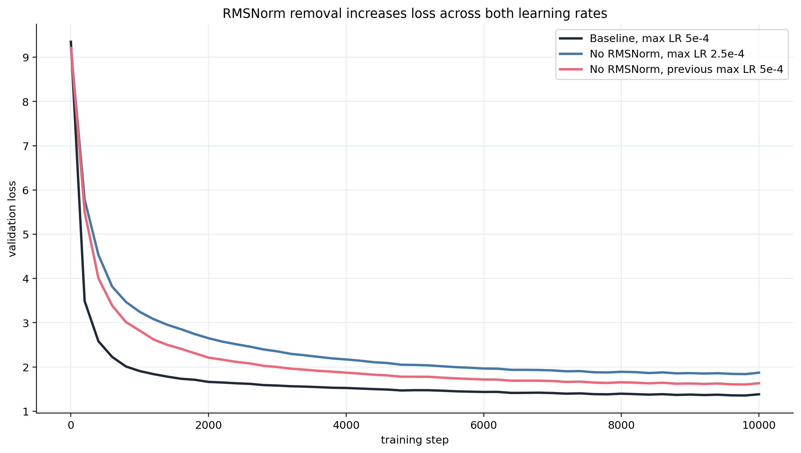

## 8. OpenWebText

OWT 使用 32K tokenizer、相同 4-layer 架构和 10,000 iterations。Batch 128 的显存探针失败，batch 64 成功，因此正式训练使用 batch 64。

| 指标 | 数值 |
| --- | ---: |
| 最终 validation loss | **4.1341** |
| 最终 train loss | 4.1892 |
| 总训练时间 | 2254.4 s（37.6 min） |
| 峰值显存 | 14.07 GiB |

OWT 的词表和数据分布与 TinyStories 不同，per-token loss 不应直接横向解释为模型质量差距。归一化曲线显示两者都持续改善，但 OWT 的绝对任务难度更高。

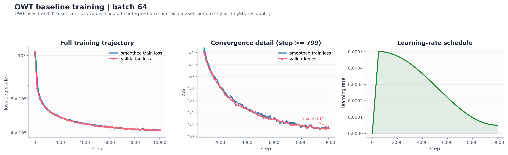

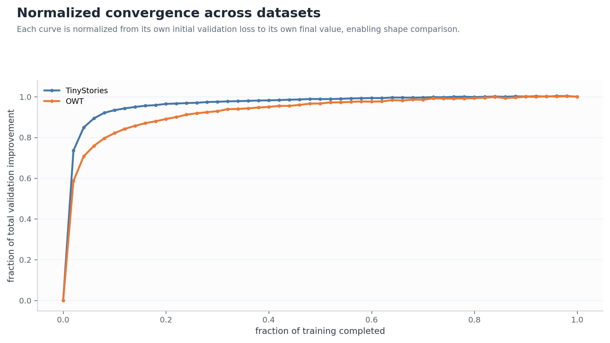

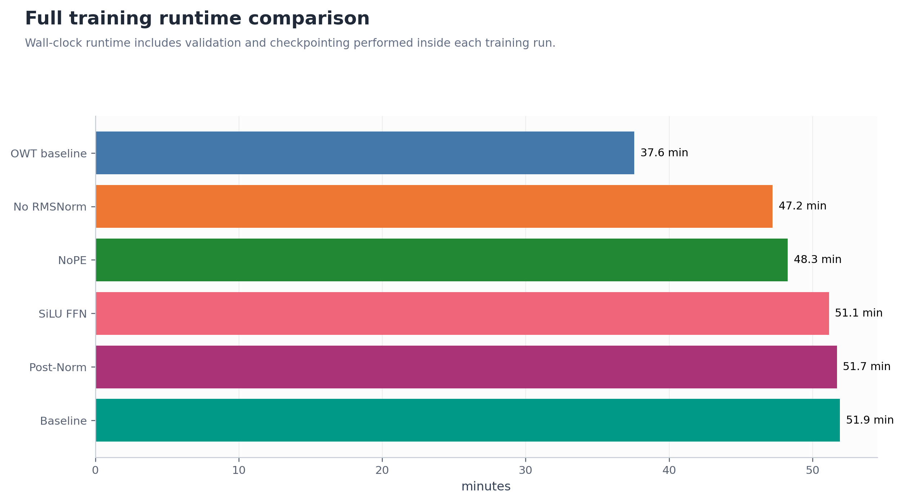

OWT 实验在 RTX 4090 上训练约 37.6 分钟，最终 validation loss 为 4.1341。相关配置、逐点日志、生成样本和训练曲线均已保存在本目录中。

## 9. 文本生成

所有样本最多生成 256 tokens，`top_p=0.95`，遇到 `<|endoftext|>` 可提前停止。完整样本位于 `logs/generation/`。

TinyStories 在 temperature 0.4 和 0.8 时能生成完整的儿童故事结构。例如：

> Once upon a time, there was a little girl named Lily. She had a big, red ball... Lily was happy that the bird was free.

temperature 1.1 增加了多样性，但出现 `aDanger`、代词混乱和不自然句子。OWT temperature 0.4 有明显的 “business model” 重复；0.8 的主题连贯性更好但事实和逻辑仍不稳定；1.1 出现大量词汇拼接和语法崩坏。这与小模型、有限训练预算以及 OWT 更高熵的数据分布一致。

## 10. 测试与验证

在 Python 3.12 环境运行未修改的公开测试：

```text
47 passed, 1 xpassed, 1 warning
```

模型、attention、训练工具、checkpoint、BPE、Tokenizer roundtrip、流式编码和内存测试均通过。测试详情保存在 `logs/test_summary.json`。唯一 warning 来自测试环境探测 CUDA 时的驱动兼容提示；公开测试实际在 CPU 路径完成，不影响断言结果。

此外，`ty check cs336_basics scripts tests/adapters.py` 为 0 diagnostics，Ruff 全通过；扩展验收脚本的模型快照、训练工具、tokenizer/BPE 检查也全部通过。

## 11. 复现说明

公开目录不复制 starter 的 lock file 和官方测试。复现时先准备题面版本 26.0.4 的 `assignment1-basics`，再把提交内容覆盖到对应位置：

```bash
export A1_DIR=/path/to/A1
cd /path/to/assignment1-basics
cp -R "$A1_DIR/submission/cs336_basics/." cs336_basics/
cp -R "$A1_DIR/submission/scripts/." scripts/
cp "$A1_DIR/submission/tests/adapters.py" tests/adapters.py
cp -R "$A1_DIR/submission/configs/." configs/

uv sync --frozen --python 3.12
uv run pytest

python scripts/train_tokenizer.py \
  --input data/TinyStoriesV2-GPT4-train.txt \
  --vocab-size 10000 \
  --special-token '<|endoftext|>' \
  --num-workers 32 \
  --output-dir artifacts/tokenizer_tinystories

python scripts/encode_dataset.py \
  --input data/TinyStoriesV2-GPT4-train.txt \
  --vocab artifacts/tokenizer_tinystories/vocab.json \
  --merges artifacts/tokenizer_tinystories/merges.json \
  --special-token '<|endoftext|>' \
  --output data/tinystories_train.npy

python scripts/train_lm.py --config configs/tinystories_baseline.json
python scripts/generate.py --help
```

提交目录中的路径对应：

- 实现：`submission/cs336_basics/`
- Adapter：`submission/tests/adapters.py`
- 训练/编码/生成入口：`submission/scripts/`
- 公开配置：`submission/configs/`
- 逐点日志与汇总：`logs/`
- 报告图：`assets/`

## 飞书补充文档

- 链接：https://fudan-nlp.feishu.cn/wiki/HQmswAhr6imCKQkmeJOcQY04nXb?from=from_copylink
