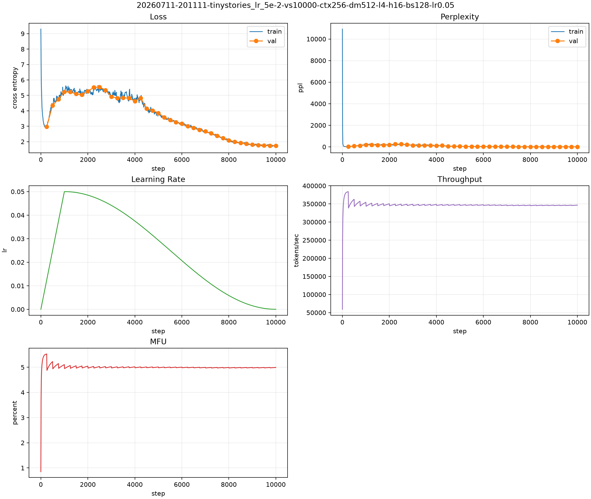
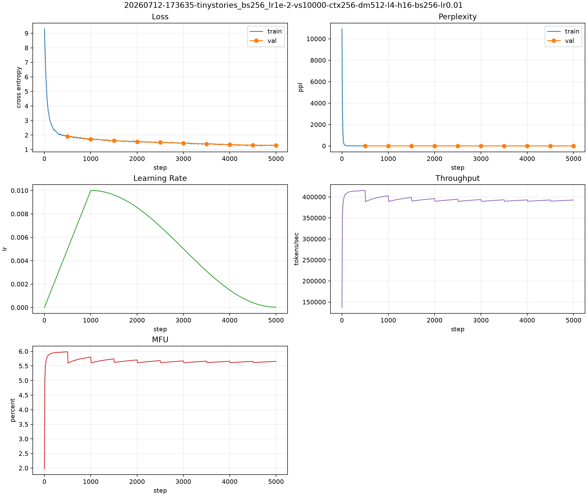
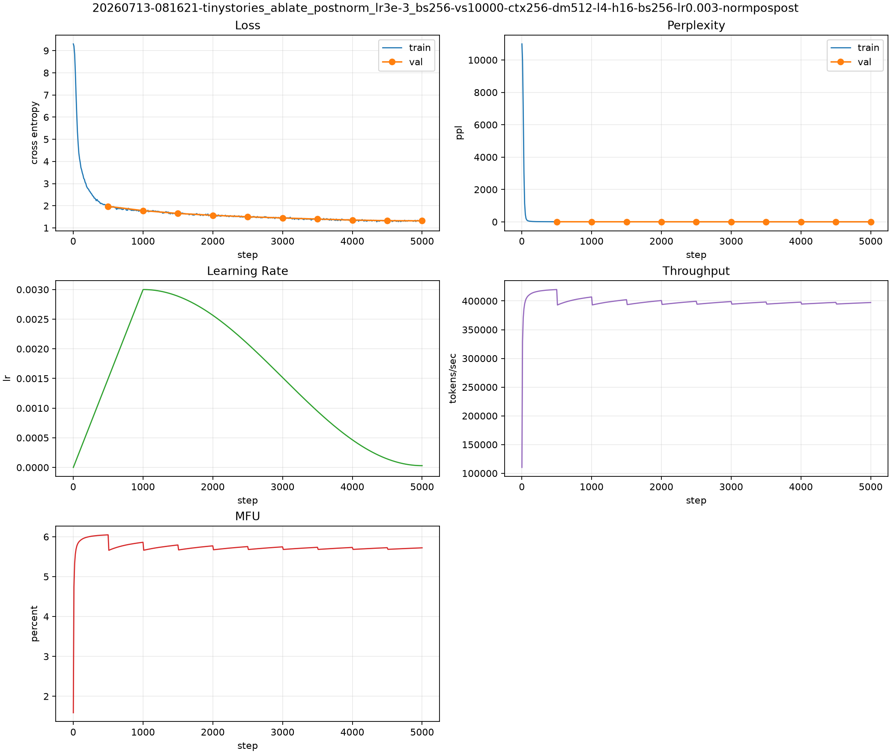
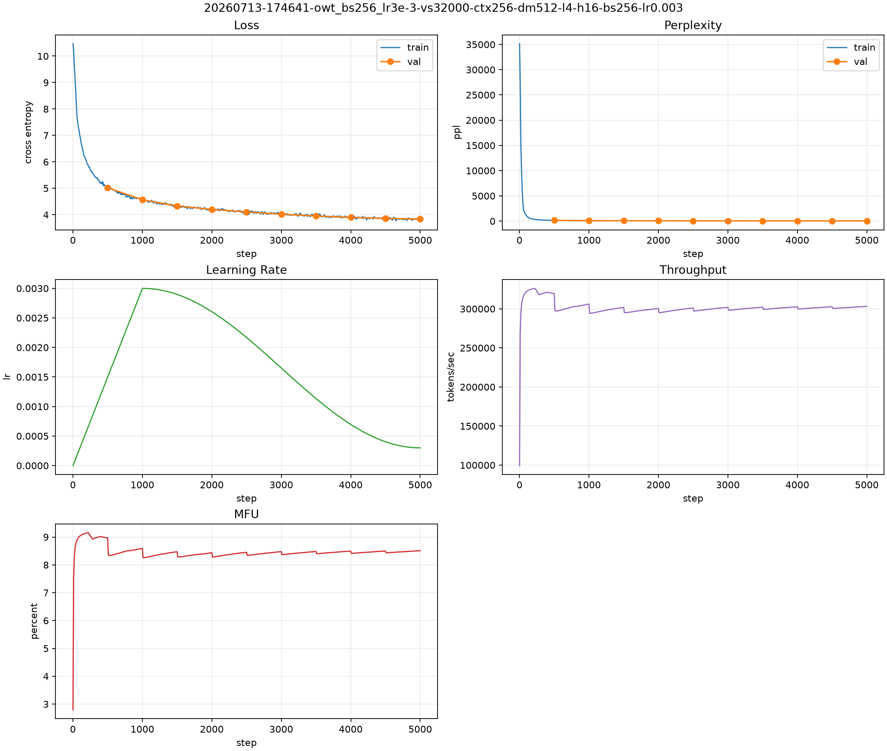

# A1 公开提交：许志鹏

> 本文件和同目录代码公开可见。只提交允许公开且已经脱敏的内容；组织内材料放在下方
> 登记的飞书补充文档中，密钥和访问凭据不进入任何提交材料。

> 本报告按 A1 26.0.4 的《报告内容》和《实验日志格式》整理。当前为阶段性记录，
> 剩余实验完成后再同步 `submission/` 并补齐最终日志与图表。

## 基本信息

- 作业题面版本：26.0.4（2026-07-13 补充报告内容与实验日志格式要求）
- 完成范围：BPE tokenizer、Tokenizer encode/decode/encode_iterable、Transformer LM、loss/optimizer/scheduler/clipping、数据加载、checkpoint、训练循环、文本生成脚本；TinyStories baseline、学习率 sweep、batch size sweep、四个架构消融、OWT tokenizer/encoding、OWT 训练与 OWT 生成样本已完成阶段性实验。
- 未完成项：提交前的最终通读检查与必要的文字精修。
- 上游 starter commit：`a158843b20107949f1a8d7df1b05cd33b9166712`
- 本地工作仓库：`../assignment1-basics`（必须与 `SummerQuest-2026` 同级）

## Markdown 报告

### 报告内容覆盖清单

根据 `assignments/A1/README.md` 的 26.0.4 要求，最终报告需要覆盖以下内容；本文件当前先记录已经完成的阶段性结果，未完成项会继续补齐。

- 书面题：`unicode1`、`unicode2`，AdamW 显存、FLOPs 与训练时间核算。
- Tokenizer 实验：TinyStories/OWT tokenizer 的 compression ratio、最长 token、throughput 与对比。
- TinyStories 训练：主训练 loss 曲线、最终 validation loss、生成样本与简评。
- 学习率 sweep：多组 LR 曲线与至少一个不稳定/发散 run。
- Batch size sweep：从小 batch 到 H100 显存上限，包含 64 和 128。
- 架构消融：删除 RMSNorm、Post-Norm、NoPE、SiLU FFN。
- OWT：训练结果、loss 曲线、生成样本与 TinyStories 差异分析。

### 书面题：`unicode1` / `unicode2` / AdamW 核算

#### `unicode1`

Unicode 和 UTF-8 不是同一层概念。Unicode 先给“字符”分配抽象编号，也就是 code point；UTF-8 再规定如何把这个编号编码成 1 到 4 个 byte。以汉字“牛”为例：

```text
字符            牛
Unicode 码点    U+725B
UTF-8 bytes     E7 89 9B
十进制 bytes    [231, 137, 155]
```

因此，`"牛"` 在 Python 中是 1 个字符，但 `len("牛".encode("utf-8")) == 3`。当题目说“iterate over bytes”时，意思是逐个访问编码后的 byte value；每次拿到的是 `0..255` 的整数，而不是已经解码好的字符。

#### `unicode2`

byte-level BPE 的起点是 256 个单 byte token，而不是直接从 Unicode 字符开始。这样做的核心好处是没有 OOV：任何文本只要能写成 UTF-8，最终都可以拆成 `0..255` 这些 byte。代价是序列一开始会比较长，尤其是中文、emoji 或其他非 ASCII 文本，一个字符往往对应多个 byte；所以需要后续 BPE merge 把高频 byte pattern 合并回更长 token，换取更短序列和更好的压缩率。

这也是本作业 tokenizer 的基本设计逻辑：先用 GPT-2 风格正则做 pre-tokenization，限制 merge 发生在局部文本片段内部；再在 byte 序列上做 BPE，兼顾“全覆盖”与“压缩序列长度”。

#### AdamW 参数量、显存与 FLOPs 核算

以下核算基于当前 TinyStories baseline：`vocab_size=10000`、`d_model=512`、`d_ff=1344`、`num_layers=4`、`num_heads=16`、`context_length=256`。

参数量分解如下：

| component | params |
| --- | ---: |
| token embedding | 5,120,000 |
| LM head | 5,120,000 |
| attention per layer | 1,048,576 |
| FFN per layer | 2,064,384 |
| RMSNorm per layer | 1,024 |
| total per transformer block | 3,113,984 |
| 4 blocks subtotal | 12,455,936 |
| final RMSNorm | 512 |
| total parameters | 22,696,448 |

当前实现的 AdamW 在 [`submission/cs336_basics/nn.py`](submission/cs336_basics/nn.py:355) 中使用 `torch.zeros_like(p)` 初始化 `exp_avg` 和 `exp_avg_sq`，所以优化器状态默认和参数 dtype 相同。在 bf16 训练下：

| item | bytes | MiB |
| --- | ---: | ---: |
| AdamW states (`exp_avg` + `exp_avg_sq`) | 90,785,792 | 86.58 |
| params + grads + AdamW states | 181,571,584 | 173.16 |

如果按更常见的“bf16 参数/梯度 + fp32 optimizer states”估算，则：

| item | bytes | MiB |
| --- | ---: | ---: |
| AdamW states in fp32 | 181,571,584 | 173.16 |
| params + grads + fp32 states | 272,357,376 | 259.74 |

单步 AdamW 更新的额外算力开销近似按 `10 * num_params` 估算，因此：

| item | value |
| --- | ---: |
| AdamW step FLOPs | 226,964,480 |
| AdamW step GFLOPs | 0.227 |

这个量相比完整前向+反向训练非常小。当前训练脚本 [`submission/scripts/train_lm.py`](submission/scripts/train_lm.py:159) 使用

```text
FLOPs/token = 6 * N + 12 * L * d_model * context_length
```

来估算训练计算量。代入本模型得到：

| item | value |
| --- | ---: |
| training FLOPs per token | 142,470,144 |
| total training tokens | 327,680,000 |
| total training FLOPs | 46.6846 PFLOPs |
| ideal time on 1x H100 (989 TFLOP/s, 100% MFU) | 47.2 sec |

真实训练远慢于这个下界，是因为实际 MFU 远小于 100%，并且还包含数据加载、kernel launch、validation、checkpoint 和 Python 调度开销。前面实验里出现的低 MFU 因而是合理现象；它反映的是当前 from-scratch 实现和训练脚本的系统效率，而不是 FLOPs 公式本身出错。

### Tokenizer 对比分析（TinyStories vs. OWT）

两组语料都使用 byte-level BPE，但数据分布差异很大，因此 tokenizer 体现出的“压缩对象”也不同。TinyStories 语料风格高度集中，句式短、重复模板多、词汇分布窄，更容易把高频短词、固定搭配和故事模板压进更短 token 序列；OWT 语料来源开放、主题更杂、专有名词更多，词表需要覆盖更丰富的英文片段，因此 vocab size 也从 TinyStories 的 10K 提高到 OWT 的 32K。

TinyStories tokenizer 与编码的可量化结果如下：

| item | value |
| --- | ---: |
| vocab size | 10,000 |
| longest token length | 15 bytes |
| longest token (UTF-8 view) | ` accomplishment` |
| train bytes/token | 4.1161 |
| val bytes/token | 4.1169 |
| train encode throughput | 4.60M tokens/sec |
| val encode throughput | 5.33M tokens/sec |
| train encode elapsed | 117.6 sec |
| val encode elapsed | 1.0 sec |

本次 OWT tokenizer 与编码的可量化结果如下：

| item | value |
| --- | ---: |
| vocab size | 32,000 |
| merges | 31,743 |
| longest token length | 64 bytes |
| longest token (UTF-8 view) | `ÃÂÃÂÃÂÃÂÃÂÃÂÃÂÃÂÃÂÃÂÃÂÃÂÃÂÃÂÃÂÃÂ` |
| train bytes/token | 4.3711 |
| val bytes/token | 4.3674 |
| train encode throughput | 1.72M tokens/sec |
| val encode throughput | 3.79M tokens/sec |
| tokenizer backend | `rust-fast_bpe` |
| tokenizer train elapsed | 338.3 sec |

TinyStories tokenizer 的最长 token 是 ` accomplishment`（带前导空格），这和 TinyStories 语料的分布很一致：它倾向于把常见英文词和带空格前缀的高频片段合并成 token。与此同时，TinyStories 的编码压缩率约为 4.12 bytes/token，明显优于 OWT 的约 4.37 bytes/token；编码吞吐也更高，说明它的语料分布更规则、更容易被 10K 词表高效压缩。

OWT 的最长 token 则更极端：长度达到 64 bytes，对应 UTF-8 视图是 `ÃÂÃÂÃÂÃÂÃÂÃÂÃÂÃÂÃÂÃÂÃÂÃÂÃÂÃÂÃÂÃÂ`。这不是“自然语言里很长的一个单词”，而更像开放网络语料中常见的 mojibake / 重复编码污染片段。也就是说，OWT 的 byte-level BPE 会把这种高频异常 byte pattern 也学进词表；这正体现了开放域数据比 TinyStories 更脏、更杂，也更容易包含编码错误或网页文本噪声。

结合训练与生成结果，仍可以得到几个稳定结论：

1. TinyStories tokenizer 更偏向压缩高频故事模板，例如常见名字、引号句式、简单功能词和结尾表达；它服务的是低熵、强模板化语料。
2. OWT tokenizer 需要覆盖更开放的词汇、新闻/论坛/说明文片段和更复杂的子词组合，因此同样的 byte-level BPE 会把更多 merge 预算花在通用英文子词而不是单一叙事模板上。
3. longest token 的形态也支持这个判断：TinyStories 的最长 token 仍是正常英文词片段，而 OWT 的最长 token 已经包含明显的数据噪声模式，说明开放域语料里的高频重复 byte 序列不仅来自“词”，也来自网页抽取与编码污染。
4. 压缩率也支持这个判断：TinyStories 约 4.12 bytes/token，OWT 约 4.37 bytes/token。前者更容易被较小词表压缩，后者因为词汇更分散、噪声更多，同等 byte-level BPE 下需要更长 token 序列表示。
5. 从下游模型表现看，TinyStories 模型很快就能学到通顺、结构完整的小故事；而 OWT 模型虽然学到英语表面风格，但仍更容易进入 repetition loop。这并不只是模型训练问题，也说明 OWT tokenizer 面对的分布本身更难压缩和建模。
6. 工程上，OWT 暴露出的主要瓶颈并不是 encode，而是 tokenizer training。Python 版 BPE 在大语料上过慢，所以这里补了 Rust fast BPE 后端，把训练时间压到约 5.6 分钟；这一步对完成 OWT 实验是必要的系统优化。

### TinyStories 学习率 sweep（阶段性）

基础模型使用作业 7.2.1 给出的 TinyStories 配置：vocab size 10000、context length 256、`d_model=512`、`d_ff=1344`、4 layers、16 heads、RoPE theta 10000。每个 run 处理 `128 * 10000 * 256 = 327,680,000` tokens，使用 cosine LR schedule 和 1000 step warmup。除 `max_lr` 外，其余主要训练参数保持一致。

| max_lr | best val loss | best step | last train loss | status | 备注 |
| ---: | ---: | ---: | ---: | --- | --- |
| 3e-4 | 1.4035 | 10000 | 1.3369 | completed | 达到作业 `<=1.45` 目标 |
| 1e-3 | 1.3301 | 10000 | 1.2618 | completed | 明显优于初始 LR |
| 2e-3 | 1.3119 | 10000 | 1.2498 | completed | 继续改善 |
| 3e-3 | 1.3070 | 10000 | 1.2472 | completed | 稳定，继续改善 |
| 5e-3 | 1.2964 | 10000 | 1.2337 | completed | 接近平台区 |
| 8e-3 | 1.2955 | 10000 | 1.2325 | completed | 第一轮 sweep 最优 |
| 1e-2 | 1.2946 | 10000 | 1.3142 | completed | 当前最佳验证损失 |
| 1.2e-2 | 1.2989 | 10000 | 1.2333 | completed | 略差于 1e-2 |
| 1.4e-2 | 1.3084 | 10000 | 1.3235 | completed | 进一步变差 |
| 1.5e-2 | 1.3040 | 9750 | 1.3469 | completed | 开始接近不稳定区 |
| 3e-2 | 1.6111 | 9750 | 1.6618 | completed | 高 LR 导致 loss 被推高，后期只部分恢复 |
| 5e-2 | 1.7414 | 9750 | 1.7881 | completed | 更明显的不稳定 / divergent run |

阶段性结论：验证损失随 `max_lr` 从 `3e-4` 增大到 `1e-2` 基本持续改善，最佳 TinyStories validation loss 目前为 `1.2946`。继续增大到 `1.2e-2`、`1.4e-2`、`1.5e-2` 后收益消失并开始退化；`3e-2` 和 `5e-2` 在 warmup 到高学习率后显著抬高 train/val loss，虽然 cosine decay 后有所恢复，但最终验证损失远差于最佳 run。这说明当前 warmup 与 batch size 下的稳定边界大致位于 `1.5e-2` 到 `3e-2` 之间。



### TinyStories batch size sweep（阶段性）

本组实验固定 `max_lr=1e-2`，除 batch size 和相应 step 数外保持基础模型配置一致。对于 `batch_size >= 32` 的 run，调整 step 数使总 token 数约等于 `327,680,000`；`batch_size=1` 仅作为短程对照，展示小 batch 的低吞吐和收敛不足。

| batch size | steps | tokens | best val loss | best step | last train loss | elapsed sec | status | 备注 |
| ---: | ---: | ---: | ---: | ---: | ---: | ---: | --- | --- |
| 1 | 10000 | 2,560,000 | 3.0733 | 10000 | 3.4562 | 143.0 | completed | 短 run；token 数远低于其他设置 |
| 32 | 40000 | 327,680,000 | 1.3847 | 40000 | 1.3406 | 3497.9 | completed | 小 batch 训练最慢且验证损失较高 |
| 64 | 20000 | 327,680,000 | 1.3205 | 20000 | 1.2961 | 950.6 | completed | 比 bs32 明显改善，但仍弱于 bs128+ |
| 128 | 10000 | 327,680,000 | 1.2946 | 10000 | 1.3142 | 185.5 | completed | 当前 LR sweep 中的 baseline 点 |
| 256 | 5000 | 327,680,000 | 1.2912 | 5000 | 1.2867 | 840.4 | completed | 当前 batch sweep 最优 |
| 512 | 2500 | 327,680,000 | 1.2979 | 2500 | 1.3141 | 815.1 | completed | 验证损失略差于 bs256；H100 显存约 46GB，未 OOM |
| 768 | 1667 | 327,745,536 | 1.3170 | 1667 | 1.3091 | 817.9 | completed | H100 显存约 67.8GB，接近可用上限但验证损失变差 |
| 896 | 1429 | 114,688,000 | 1.6943 | 500 | n/a | 282.4 | failed | 一开始约 79.0GB，验证后继续训练时 OOM |
| 1024 | 1250 | 0 | n/a | n/a | n/a | 0.7 | failed | H100 80GB 上 OOM，未开始训练 |

阶段性结论：在固定 `max_lr=1e-2` 时，batch size 从 32 增大到 256 明显改善验证损失，`bs256` 达到当前最佳 `1.2912`。继续增大到 `bs512` 和 `bs768` 后验证损失变差，说明在该学习率和 token budget 下更大的 batch 并不继续改善泛化。显存方面，`bs512` 约 46GB、`bs768` 约 67.8GB，均可在 H100 80GB 上完成；`bs896` 启动时约 79.0GB，并在第一次验证后继续训练时 OOM；`bs1024` 启动即 OOM。因此当前实现和配置下的实际可用 batch 上限约为 768。`bs1` 的短 run 不与等 token run 直接比较，但说明极小 batch 在同样 step 数下只处理少量 token，收敛明显不足。后续正式分析应结合曲线、吞吐和 MFU，对 `bs256`、`bs512` 和 `bs768` 做主要比较。



下一步实验：以 `max_lr=1e-2`、`batch_size=256` 作为 TinyStories 当前最佳 baseline，同时保留 `batch_size=128` 作为与 LR sweep 对齐的参考点。TinyStories 的学习率、batch size 和四个架构消融已经完成阶段性结果；接下来需要用最佳 checkpoint 生成 TinyStories 样本，并开始 OWT tokenizer、数据编码、训练和生成。公开 README 记录可公开的关键结果，百科/飞书补充文档记录更完整的运行截图、曲线图索引和过程性备注，但不放置密钥、内部绝对路径或大文件。

### TinyStories 架构消融（阶段性）

当前消融以 `batch_size=256`、`steps=5000`、`max_lr=1e-2` 的最佳 TinyStories baseline 为对照。baseline 为 Pre-Norm + RMSNorm + RoPE + SwiGLU，验证损失 `1.2912`。

| run | variant | max_lr | best val loss | best step | last train loss | status | 现象 |
| --- | --- | ---: | ---: | ---: | ---: | --- | --- |
| baseline | Pre-Norm + RMSNorm | 1e-2 | 1.2912 | 5000 | 1.2867 | completed | 当前最佳 TinyStories baseline |
| no_rmsnorm | 删除 RMSNorm | 1e-2 | n/a | n/a | NaN | completed | 训练过程中 loss 最终变成 NaN，未得到有效 validation checkpoint |
| postnorm | Post-Norm | 1e-2 | 1.7818 | 1500 | 5.8201 | completed | 前期下降，约 step 1500 后 loss 跳升并维持高位 |
| no_rmsnorm_lr3e-3 | 删除 RMSNorm | 3e-3 | 2.1673 | 1000 | NaN | completed | 降低 LR 后仍最终 NaN，best validation loss 也明显较差 |
| postnorm_lr3e-3 | Post-Norm | 3e-3 | 1.3190 | 5000 | 1.3138 | completed | 降低 LR 后恢复稳定，但仍差于 Pre-Norm baseline |
| nope | No positional embedding | 1e-2 | 1.3725 | 5000 | 1.3668 | completed | 稳定训练，但显著差于 RoPE baseline |
| silu | SiLU FFN, `d_ff=2048` | 1e-2 | 1.3006 | 5000 | 1.2927 | completed | 稳定且接近 baseline，但略差于 SwiGLU |

阶段性结论：在当前最佳 baseline 的 `max_lr=1e-2` 下，删除 RMSNorm 和改用 Post-Norm 都表现出明显优化不稳定。No-RMSNorm run 最终出现 NaN；Post-Norm run 虽然完成 5000 step，但 best validation loss 只有 `1.7818`，远差于 baseline `1.2912`。降低到 `max_lr=3e-3` 后，Post-Norm 可以稳定训练并达到 `1.3190`，说明它主要需要更保守 LR，但仍不如 Pre-Norm RMSNorm baseline；No-RMSNorm 即使降 LR 后仍最终 NaN，且最好的 validation loss 只有 `2.1673`，说明 RMSNorm 对本设置下的稳定训练是关键组件。NoPE 可以稳定训练，但 validation loss `1.3725` 明显差于 RoPE baseline，说明显式位置信息对 TinyStories 仍有帮助。参数量近似匹配的 SiLU FFN 达到 `1.3006`，接近但略差于 SwiGLU 的 `1.2912`，说明 SwiGLU 在该设置下有小幅优势。



### TinyStories 生成样本（阶段性）

使用当前最佳 TinyStories checkpoint（`batch_size=256`、`max_lr=1e-2`、best validation loss `1.2912`）生成，prompt 为 `Once upon a time`，temperature `0.8`，top-p `0.9`。

```text
Once upon a time, there was a big, heavy rock. It lived in a forest with many trees and animals. One day, a little bird named Tim saw the rock and wanted to sit on it.
"Hi, rock!" said Tim. "Can I sit on you?" The rock did not say anything. Tim was sad. He wanted to sit on the rock, but it was too heavy for him.
Just then, a big bear named Ben came to the forest. Ben saw Tim and the rock and said, "Don't be sad, Tim. I can help you sit on the rock." Tim was happy and said, "Thank you, Ben!"
Together, Tim and Ben sat on the heavy rock. They talked and laughed. The rock started to move! It was not a rock at all, but a big, sleepy bear. The bear woke up and said, "I am not a rock, I am a bear!" Tim and Ben were very surprised, but they laughed and became good friends.
<|endoftext|>
```

简评：样本语法通顺，保持了 TinyStories 常见的短句、角色互动和结尾反转结构；故事有明确开头、冲突和结尾。缺点是情节逻辑较简单，并出现了两个 bear 角色导致轻微重复/混淆，但整体已经符合 TinyStories baseline 的预期质量。

### OWT tokenizer 与编码（阶段性）

OWT tokenizer 使用训练集 `owt_train.txt` 训练，vocab size 为 32000，special token 为 `<|endoftext|>`。为了在 40 CPU cores 的机器上完成训练，使用了 Rust fast BPE 后端；该后端保持与 Python `train_bpe` 相同的 merge 顺序和输出格式，并在公开 fixtures 上做过 vocab/merges 完全一致性验证。

| item | value |
| --- | ---: |
| train input bytes | 11,920,511,059 |
| validation input bytes | 289,998,753 |
| vocab size | 32,000 |
| merges | 31,743 |
| tokenizer backend | `rust-fast_bpe` |
| tokenizer workers | 40 |
| tokenizer core elapsed | 317.1 sec |
| tokenizer wrapper elapsed | 338.3 sec |
| train tokens | 2,727,120,452 |
| train bytes/token | 4.3711 |
| train encode throughput | 1,715,281.6 tokens/sec |
| train encode elapsed | 1,589.9 sec |
| validation tokens | 66,401,098 |
| validation bytes/token | 4.3674 |
| validation encode throughput | 3,788,673.9 tokens/sec |
| validation encode elapsed | 17.5 sec |

阶段性结论：OWT 的 tokenizer 训练和编码已经完成，`uint16` 可以容纳最大 token id 31999。训练集编码后约为 27.27 亿 tokens，压缩率约 4.37 bytes/token，可用于后续 OWT LM 训练。Rust BPE 后端将原本多小时的 Python BPE 训练缩短到约 5.6 分钟；编码阶段仍由 Python tokenizer 完成，训练集编码耗时约 26.5 分钟，是数据准备阶段剩余的主要 CPU 成本。

### OWT 训练（阶段性）

本组使用与 TinyStories baseline 相同的模型架构：context length 256、`d_model=512`、`d_ff=1344`、4 layers、16 heads、RoPE theta 10000。前两组 OWT run 使用 `batch_size=256, steps=5000`，因此 processed tokens 为 `256 * 5000 * 256 = 327,680,000`，与 TinyStories 原 `batch_size=128, steps=10000` baseline 的 token budget 相同，但 iteration 数不同。后续补跑了题面要求更严格的 same-iteration 版本 `batch_size=128, steps=10000`，并额外测试了更高学习率的 `batch_size=256, steps=5000, max_lr=3e-3`。

| run | max_lr | batch size | steps | tokens | best val loss | best step | last train loss | elapsed sec | status |
| --- | ---: | ---: | ---: | ---: | ---: | ---: | ---: | ---: | --- |
| `owt_bs256_lr3e-4` | 3e-4 | 256 | 5000 | 327,680,000 | 4.1657 | 5000 | 4.1879 | 1236.4 | completed |
| `owt_bs256_lr1e-3` | 1e-3 | 256 | 5000 | 327,680,000 | 3.8898 | 5000 | 3.9124 | 1202.8 | completed |
| `owt_bs128_lr1e-3` | 1e-3 | 128 | 10000 | 327,680,000 | 3.8751 | 10000 | 3.9147 | 1147.7 | completed |
| `owt_bs256_lr3e-3` | 3e-3 | 256 | 5000 | 327,680,000 | 3.8366 | 5000 | 3.8664 | 1089.9 | completed |

阶段性结论：在相同 token budget 下，OWT 上 `max_lr=1e-3` 明显优于更保守的 `3e-4`，best validation loss 从 `4.1657` 降到 `3.8898`；进一步升到 `3e-3` 后继续改善到 `3.8366`，且最后一步仍是 best step，说明当前 5000 step 下还没有明显过拟合。same-iteration run `owt_bs128_lr1e-3` 的 best validation loss 为 `3.8751`，和 `owt_bs256_lr1e-3` 非常接近，说明在固定总 token 数时，把 batch 从 128 提到 256 并把 step 减半没有造成明显退化。OWT validation loss 高于 TinyStories 是预期现象：OWT 语料分布更开放、主题更多、词表为 32K，预测不确定性显著高于儿童故事语料。



### OWT 生成样本（阶段性）

使用当前最佳 OWT checkpoint（`batch_size=256`、`steps=5000`、`max_lr=3e-3`、best validation loss `3.8366`）生成，prompt 为 `The`，temperature 与 top-p 使用脚本默认值。

```text
The path to our future, but I will show you how to construct a simulation based on what we think we should be.

We are actively looking at a simulation based on what we should be seeing today and I am not saying that is a form of simulation. If you are looking at a simulation based on what we think we should be seeing, you can see that you are looking at a simulation based on what we see in the simulation.

Here is the breakdown of the simulation into how we think of a simulation based on what we see here.

The model simulation is an examination of the simulation of a simulation based on what we think is a form of simulation based on what we see here.

The model simulation is a simulation based on how we think about a simulation based on what we see here.

The model simulation is a simulation based on what we see here.

The model simulation is a simulation based on what we see here.

The simulation simulation is a simulation based on how we see there are no scenarios that we see here.

The simulation simulation is a simulation based on what we see here.

The simulation simulation is a simulation simulation based on the simulation simulation simulation simulation simulation.

The simulation simulation
```

简评：样本已经明显脱离 TinyStories 的儿童故事风格，转向英语评论/技术说明文的句式和语气；局部语法是流畅的，但语义内容很快坍缩到高频短语反复自指，出现明显的 repetition loop。这与 OWT 上当前 validation loss 仍较高的阶段性结果一致，说明模型已学到开放域英文表面风格，但全局语义组织和采样稳定性仍然不足。

### 后续实验命令模板

batch size sweep 保持总 token 数约为 `327,680,000`：

```bash
CUDA_VISIBLE_DEVICES=0 EXPERIMENT_NAME=tinystories_bs64_lr1e-2 BATCH_SIZE=64 STEPS=20000 MAX_LR=1e-2 scripts/train_tinystories_baseline.sh
CUDA_VISIBLE_DEVICES=1 EXPERIMENT_NAME=tinystories_bs256_lr1e-2 BATCH_SIZE=256 STEPS=5000 MAX_LR=1e-2 scripts/train_tinystories_baseline.sh
CUDA_VISIBLE_DEVICES=0 EXPERIMENT_NAME=tinystories_bs512_lr1e-2 BATCH_SIZE=512 STEPS=2500 MAX_LR=1e-2 scripts/train_tinystories_baseline.sh
CUDA_VISIBLE_DEVICES=1 EXPERIMENT_NAME=tinystories_bs768_lr1e-2 BATCH_SIZE=768 STEPS=1667 MAX_LR=1e-2 scripts/train_tinystories_baseline.sh
CUDA_VISIBLE_DEVICES=0 EXPERIMENT_NAME=tinystories_bs896_lr1e-2 BATCH_SIZE=896 STEPS=1429 MAX_LR=1e-2 scripts/train_tinystories_baseline.sh
```

架构消融使用同一训练脚本的环境变量开关：

```bash
# Remove RMSNorm.
CUDA_VISIBLE_DEVICES=0 EXPERIMENT_NAME=tinystories_ablate_no_rmsnorm_bs256 BATCH_SIZE=256 STEPS=5000 NORM_TYPE=none MAX_LR=1e-2 scripts/train_tinystories_baseline.sh

# Remove RMSNorm with lower LR if the 1e-2 run is unstable.
CUDA_VISIBLE_DEVICES=0 EXPERIMENT_NAME=tinystories_ablate_no_rmsnorm_lr3e-3_bs256 BATCH_SIZE=256 STEPS=5000 NORM_TYPE=none MAX_LR=3e-3 scripts/train_tinystories_baseline.sh

# Post-norm instead of pre-norm.
CUDA_VISIBLE_DEVICES=1 EXPERIMENT_NAME=tinystories_ablate_postnorm_bs256 BATCH_SIZE=256 STEPS=5000 NORM_POSITION=post MAX_LR=1e-2 scripts/train_tinystories_baseline.sh

# Post-norm with lower LR if the 1e-2 run is unstable.
CUDA_VISIBLE_DEVICES=1 EXPERIMENT_NAME=tinystories_ablate_postnorm_lr3e-3_bs256 BATCH_SIZE=256 STEPS=5000 NORM_POSITION=post MAX_LR=3e-3 scripts/train_tinystories_baseline.sh

# No positional embedding.
CUDA_VISIBLE_DEVICES=0 EXPERIMENT_NAME=tinystories_ablate_nope_bs256 BATCH_SIZE=256 STEPS=5000 POS_EMB=none MAX_LR=1e-2 scripts/train_tinystories_baseline.sh

# SiLU FFN with d_ff=4*d_model for approximate parameter-count matching.
CUDA_VISIBLE_DEVICES=1 EXPERIMENT_NAME=tinystories_ablate_silu_bs256 BATCH_SIZE=256 STEPS=5000 FFN_TYPE=silu D_FF=2048 MAX_LR=1e-2 scripts/train_tinystories_baseline.sh
```

OWT 数据准备、训练与生成：

```bash
DOWNLOAD_OWT=1 scripts/download_a1_data.sh
TOKENIZER_WORKERS=40 ENCODE_WORKERS=40 scripts/prepare_owt.sh

# Equal-token budget with the current TinyStories best run; start with a conservative OWT LR.
CUDA_VISIBLE_DEVICES=0 EXPERIMENT_NAME=owt_bs256_lr3e-4 BATCH_SIZE=256 STEPS=5000 MAX_LR=3e-4 scripts/train_owt_baseline.sh

# Strictly same iterations as the original TinyStories 10k-step baseline.
CUDA_VISIBLE_DEVICES=0 EXPERIMENT_NAME=owt_bs128_lr1e-3 BATCH_SIZE=128 STEPS=10000 MAX_LR=1e-3 MIN_LR=1e-4 scripts/train_owt_baseline.sh

# Optional OWT LR sweep after the first two runs are stable.
CUDA_VISIBLE_DEVICES=1 EXPERIMENT_NAME=owt_bs256_lr1e-3 BATCH_SIZE=256 STEPS=5000 MAX_LR=1e-3 scripts/train_owt_baseline.sh

# Higher LR candidate that currently gives the best OWT validation loss.
CUDA_VISIBLE_DEVICES=1 EXPERIMENT_NAME=owt_bs256_lr3e-3 BATCH_SIZE=256 STEPS=5000 MAX_LR=3e-3 MIN_LR=3e-4 scripts/train_owt_baseline.sh

RUN_DIR=runs/20260713-174641-owt_bs256_lr3e-3-vs32000-ctx256-dm512-l4-h16-bs256-lr0.003 scripts/generate_owt_sample.sh
```

## 复现说明

- 环境与依赖：开发与 CPU 测试在 WSL2 / Linux Python 3.12 环境中完成，主要依赖为 `torch`、`numpy`、`pytest`、`pytest-timeout`、`psutil`、`regex`、`tiktoken`、`einops`、`jaxtyping`；正式训练在 H100 机器上完成。A1 公开提交不额外携带依赖文件，统一复用 `../assignment1-basics/uv.lock`。
- 数据准备：使用 `submission/scripts/download_a1_data.sh` 下载 TinyStories / OpenWebText 文本数据，再通过 `prepare_tinystories.sh` 与 `prepare_owt.sh` 训练 tokenizer、编码为 `uint16` token arrays，并产出对应 metadata。OWT tokenizer 训练使用 Rust fast BPE 后端以缩短大语料预处理时间。
- Tokenizer、训练与生成命令：见 `submission/scripts/`，阶段性训练命令见上方命令模板。
- 同步命令：`python3 scripts/sync_a1_submission.py --name '许志鹏'`
- 配置文件：无

## 代码与脚本

- 真实实现：`submission/cs336_basics/`
- 测试 adapter：`submission/tests/adapters.py`
- 训练、数据编码与生成脚本：`submission/scripts/`
- 实现说明：`cs336_basics/tokenizer.py` 实现 byte-level BPE 训练与 tokenizer encode/decode/encode_iterable；`cs336_basics/nn.py` 实现 Linear、Embedding、RMSNorm、SwiGLU、RoPE、attention、Transformer LM、cross-entropy、gradient clipping 与 AdamW；`cs336_basics/data.py` 实现 batch sampling；`submission/scripts/` 下提供 tokenizer 训练、数据编码、TinyStories/OWT 训练、checkpoint 恢复、生成与曲线绘制脚本。为完成 OWT tokenizer 训练，还补充了 `scripts/fast_bpe/` Rust 后端及其 Python wrapper。

真实实现先在兄弟目录 `../assignment1-basics` 中完成并通过官方测试，再使用同步命令复制
到本目录。不要手工复制公共 tests、fixtures、数据、模型权重、虚拟环境或依赖锁。

## 实验日志

- 日志目录：`logs/`
- 当前阶段性文件：`logs/tinystories_lr_sweep_stage.jsonl`、`logs/tinystories_batch_sweep_stage.jsonl`、`logs/tinystories_ablation_stage.jsonl`、`logs/owt_tokenizer_stage.jsonl`、`logs/owt_training_stage.jsonl` 记录各组 run summary，每行一个 JSON 对象。
- 26.0.4 核心日志要求：训练类 run 需要逐点记录 `step`、`wall_clock_sec`、`train_loss`、`lr`，并定期记录 `val_loss`；还需要最终 val loss、总训练时间和关键配置。
- 当前训练脚本原始日志：训练机上的每个 run 目录都产出 `train_log.jsonl`，其中记录 `step`、`split`、`loss`、`lr`、`elapsed_sec`、`tokens`、`tokens_per_sec`、`mfu_percent`，validation 行记录 `best_val_loss`、`best_step`。这些字段与核心要求等价。
- 当前提交状态：关键 run 的 `train_log.jsonl` 已复制到本目录 `logs/`，并保留 summary JSONL 作为总览；曲线 PNG 已放入 `assets/` 并在 README 中引用。

## 飞书补充文档

- 链接：https://fudan-nlp.feishu.cn/wiki/Zw0DwUU9IiskkAkdieTcTnKVnte

该文档设置为组织内公开，不得开启互联网公开访问，只保存不能公开到 GitHub 但确有审核必要的最小差量材料。
