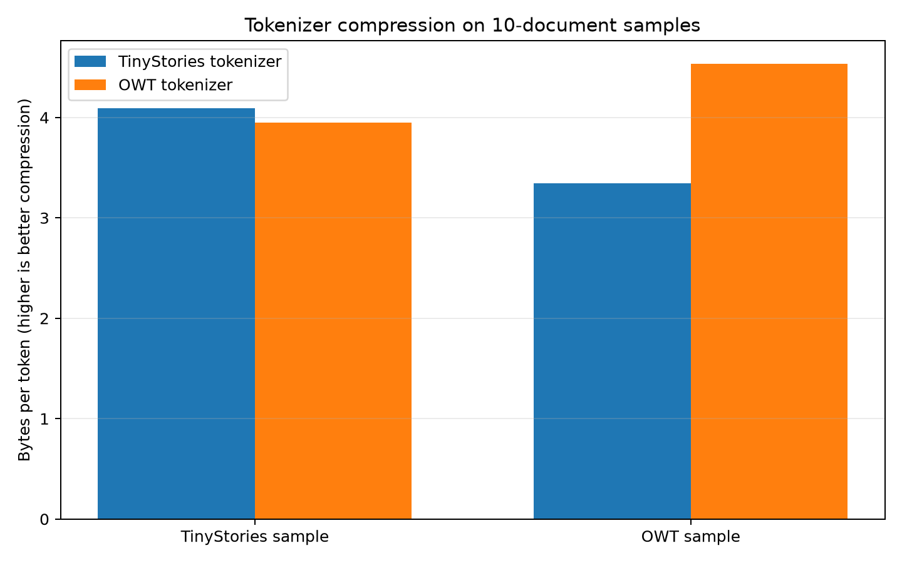
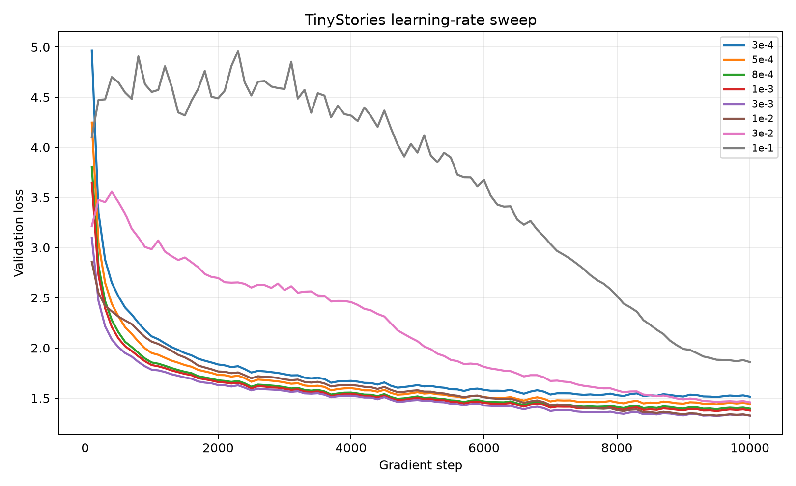
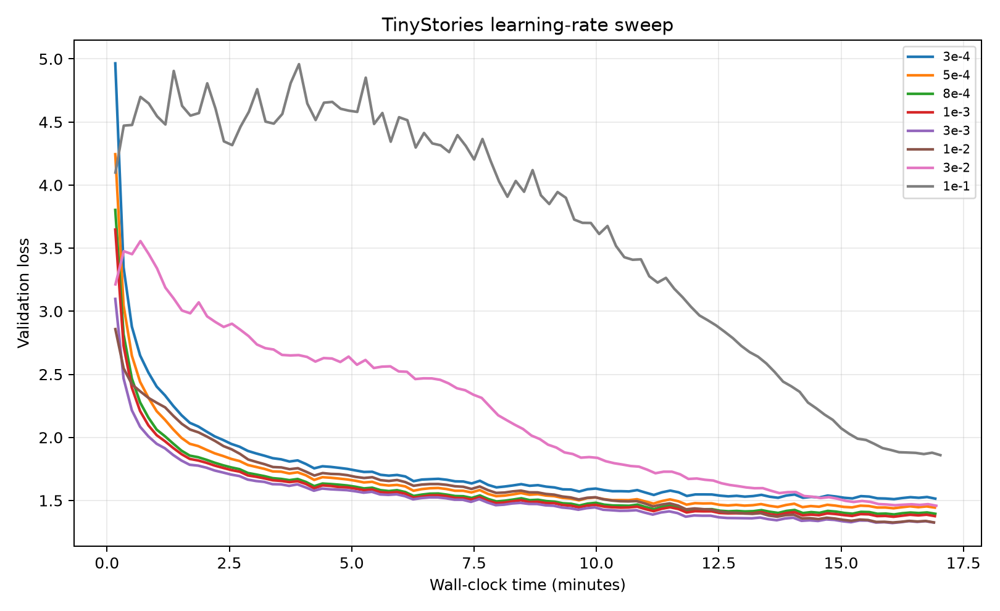
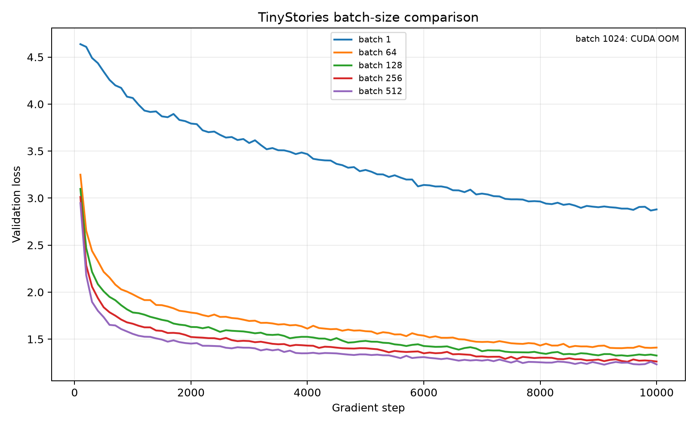
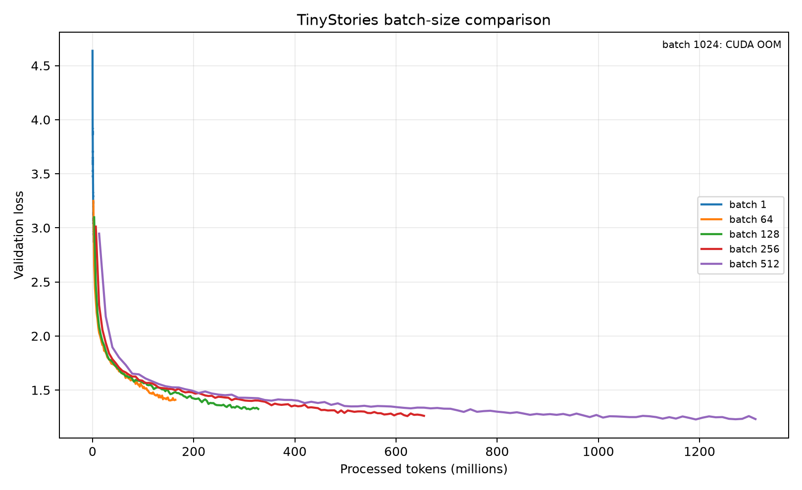
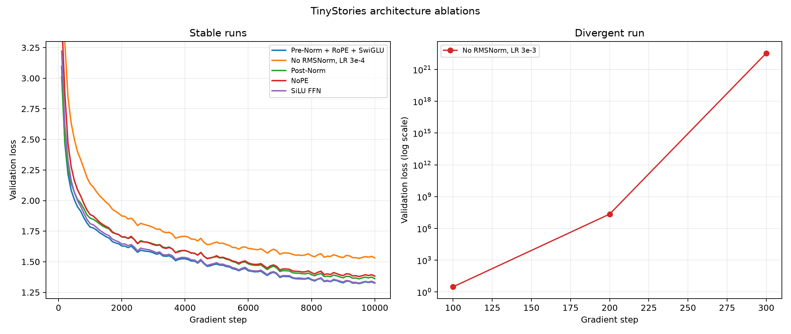
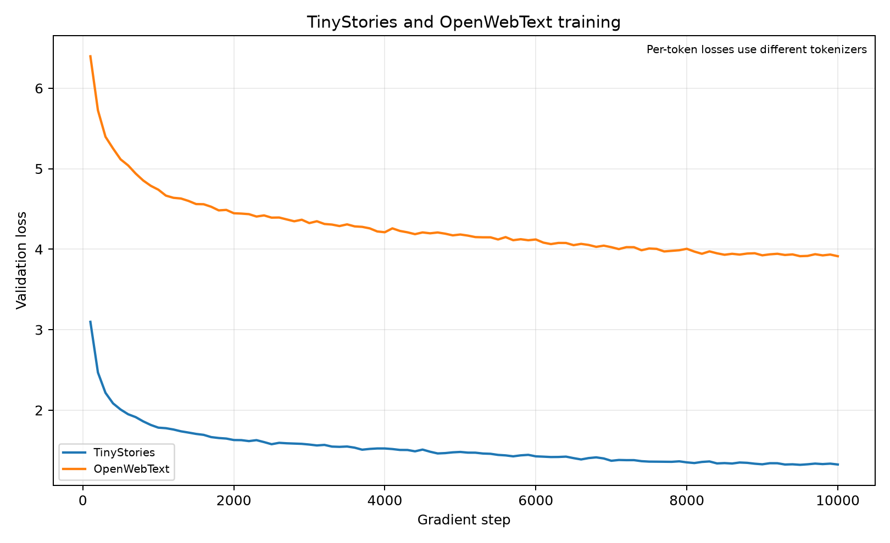

# A1 公开提交：金罗智杰

> 本文档和同目录代码公开可见。报告仅包含可公开的数据集、实现和脱敏实验结果，不包含服务器标识、内部路径或访问凭据。

## 基本信息

- 作业题面版本：26.0.4
- 完成范围：byte-level BPE、Tokenizer、Transformer LM、AdamW 与训练基础设施、TinyStories 完整实验与消融、OpenWebText 训练与生成
- 未完成项：无（原课程 leaderboard 不属于 OpenMOSS A1 必做范围）
- 上游 starter commit：`a158843b20107949f1a8d7df1b05cd33b9166712`
- 本地工作仓库：`../assignment1-basics`

## 1. Unicode 与 UTF-8

### 1.1 `unicode1`

1. `chr(0)` 返回 Unicode 空字符 NUL，即 `U+0000`。
2. 它的 `repr` 是可见的转义形式 `'\x00'`，直接打印时则是一个不可见的控制字符。
3. NUL 会作为真实字符保留在 Python 字符串中并计入长度，但终端通常不显示它，且某些 C 风格接口会将其视为字符串终止符。

### 1.2 `unicode2`

1. UTF-8 对 ASCII 兼容且英文网页文本通常更紧凑，没有 UTF-16/UTF-32 常见的字节序和 NUL 字节问题；它也是网络文本的主流编码。
2. `"\u725b".encode("utf-8") == b'\xe7\x89\x9b'` 会使错误函数在解码第一个 byte 时抛出 `UnicodeDecodeError`，因为多字节 UTF-8 字符必须整体解码，不能逐 byte 解码。
3. `b'\xc0\x80'` 不能解码为合法 Unicode 文本，因为它是 NUL 的非法 overlong UTF-8 表示。

## 2. Byte-level BPE 与 Tokenizer

### 2.1 实现

BPE 从 256 个单 byte token 和 special tokens 开始，使用 GPT-2 正则预分词，只在同一 pre-token 内统计相邻 pair。每轮选择频数最高的 pair，并在并列时按字节序选择更大者。`<|endoftext|>` 是不参与合并统计的硬边界。为避免对 OWT 一次性读取占用大量内存，预分词按块读取，只在文档边界提交完整内容。

Tokenizer 编码时先分离 special tokens，再对每个 pre-token 按训练得到的 merge rank 合并；解码时先拼接所有 token bytes，再一次性用 UTF-8 解码并替换非法序列。`encode_iterable` 支持大文件流式编码，且不会因任意 chunk 边界改变 tokenization。

### 2.2 TinyStories 10K BPE

- 词表大小：10,000；merges：9,743；special token ID：256。
- 训练用时：716.529 秒（11.94 分钟）；峰值 RSS：10,855.2 MiB，满足 30 分钟/30 GB 限制。
- 最长 token 为 15 bytes，例如 `b' accomplishment'`、`b' disappointment'` 和 `b' responsibility'`。这些是故事语料中常见的完整英文词，结果合理。
- 运行观察表明，主要耗时来自反复选择最高频 pair 并更新受影响 pre-token 的 merge 循环，文件序列化占比很小。

### 2.3 OpenWebText 32K BPE

- 词表大小：32,000；merges：31,743；special token ID：256。
- 训练用时：3,416.680 秒（56.94 分钟）；峰值 RSS：13,025.9 MiB，满足 12 小时/100 GB 限制。
- 最长 token 为 64 bytes，包括 64 个连字符以及重复的乱码字节片段。前者对应网页分隔符，后者反映 web crawl 中的编码噪声，均符合 OWT 的数据特征。

### 2.4 Tokenizer 对比与数据编码

使用固定 seed 从两个训练集分别流式抽样 10 篇文档：

| 样本 | bytes | TinyStories tokenizer tokens | TinyStories bytes/token | OWT tokenizer tokens | OWT bytes/token |
| --- | ---: | ---: | ---: | ---: | ---: |
| TinyStories，10 docs | 8,648 | 2,114 | 4.0908 | 2,189 | 3.9507 |
| OWT，10 docs | 88,949 | 26,601 | 3.3438 | 19,611 | 4.5357 |

TinyStories tokenizer 在 TinyStories 样本上更紧凑，OWT tokenizer 在 OWT 样本上更紧凑，说明 BPE merges 有明显的领域依赖。用 TinyStories tokenizer 处理 OWT 时从 4.5357 降到 3.3438 bytes/token，序列显著变长。

OWT 全量编码实测输入吞吐约 0.65 MiB/s。按 11,920,511,059 bytes / 17,403.259 秒线性外推，单进程编码 825 GB Pile 约需 334.57 小时（13.94 天）。

TinyStories 和 OWT 最大 token ID 分别为 9,999 和 31,999，都小于 `uint16` 的上限 65,535，因此 `uint16` 可无损存储 token ID，并比 `uint32` 节省一半空间。最终编码规模为：

| 数据 | token 数 | dtype | 编码时间 |
| --- | ---: | --- | ---: |
| TinyStories train | 541,229,347 | `uint16` | 3,654.143 s |
| TinyStories validation | 5,465,883 | `uint16` | 33.458 s |
| OWT train | 2,727,120,452 | `uint16` | 17,403.259 s |
| OWT validation | 66,401,098 | `uint16` | 439.563 s |



## 3. Transformer LM 实现

实现的 decoder-only Transformer 为：Token Embedding → 多层 Pre-Norm Transformer Block → Final RMSNorm → LM Head。所有核心组件均从零实现，没有使用现成的 `nn.Linear`、`nn.Embedding`、`torch.optim.AdamW` 或 attention 实现。

- Linear 权重形状为 `(d_out, d_in)` 且无 bias；Embedding 直接学习查表。
- RMSNorm 在求平方前转为 `float32`；SwiGLU 使用三个无 bias 矩阵。
- RoPE 只旋转 Q/K；causal mask 中 `True` 表示允许 attention。
- attention softmax 在 `exp` 前减去最大值；LM forward 返回 logits，不提前 softmax。
- 权重使用 ±3σ 截断正态分布初始化。

上游完整官方测试结果为 `47 passed, 1 xpassed`，退出码为 0；`xpassed` 表示一个上游标记为预期失败的用例在当前实现中通过。

### 3.1 Transformer 资源核算

记词表大小为 `V`、序列长度为 `T`、层数为 `L`、模型维度为 `D`、FFN 维度为 `F`。本实现不共享 input embedding 与 LM head，所以参数量为：

$$
P = 2VD + L(4D^2 + 3DF + 2D) + D.
$$

GPT-2 XL 形状（`V=50257, T=1024, L=48, D=1600, F=4288`）共有 1,640,452,800 个可训练参数，FP32 权重需要 6.562 GB（6.111 GiB）。

单个长度 `T` 序列的主要矩阵乘 FLOPs 为：

- Q/K/V 投影：每层 `6TD²`；attention 输出投影：每层 `2TD²`；
- `QKᵀ` 与 attention-weighted V：每层各 `2T²D`；
- SwiGLU 的三个投影：每层 `6TDF`；
- LM head：`2TDV`。

因此总量是 `L(8TD² + 4T²D + 6TDF) + 2TDV`。GPT-2 XL 在 `T=1024` 时需要 3.51677 TFLOPs/序列，其中 FFN 占 57.53%，attention 投影占 28.62%，attention 矩阵占 9.16%，LM head 占 4.68%；FFN 是最大计算项。

| 形状 | `d_ff` | 总 FLOPs | Attention 投影 | Attention 矩阵 | FFN | LM head |
| --- | ---: | ---: | ---: | ---: | ---: | ---: |
| GPT-2 small | 2,048 | 0.29165 T | 19.88% | 13.25% | 39.76% | 27.10% |
| GPT-2 medium | 2,752 | 0.83017 T | 24.83% | 12.42% | 50.05% | 12.70% |
| GPT-2 large | 3,392 | 1.76853 T | 27.32% | 10.93% | 54.30% | 7.45% |
| GPT-2 XL | 4,288 | 3.51677 T | 28.62% | 9.16% | 57.53% | 4.68% |

模型变大时，层内的 attention 投影和 FFN 占比上升，而只执行一次的 LM head 占比明显下降；固定 `T=1024` 时二次方 attention 矩阵的占比也略降。将 GPT-2 XL 的 `T` 增大到 16,384 后，总量增至 133.578 TFLOPs，是原来的 37.98 倍；attention 矩阵因 `T²` 增长而从 9.16% 上升到 61.73%，成为主要开销。

## 4. 训练基础设施

实现包括数值稳定的 cross-entropy、解耦 weight decay 的 AdamW、warmup + cosine learning-rate schedule、global gradient clipping、mmap 随机 batch、checkpoint 保存/恢复，以及 JSONL 实验日志。Checkpoint 保存 model state、optimizer state 和 iteration，可继续训练。

### 4.1 SGD learning-rate toy experiment

对题目中 `loss=(weights**2).mean()` 的 10×10 参数，SGD 每次把权重乘以 `1-lr/50`。因此 `lr=10` 时 loss 稳定且较快下降，`lr=100` 时权重每次变号但 loss 保持不变，`lr=1000` 时 loss 每次约放大 361 倍并迅速发散。

### 4.2 AdamW 资源核算

令 batch size 为 `B`，其余符号同上，并按题意令 `F=8D/3`。忽略 allocator workspace 和少量 scalar state，按题目列出的 activation 计数，FP32 峰值内存（bytes）为：

$$
\begin{aligned}
M_{param} &= 4P,\\
M_{grad} &= 4P,\\
M_{opt} &= 8P,\\
M_{act} &= 4B\left[L(8TD+4TF+2HT^2)+TD+2TV\right],\\
M_{total} &= 16P + M_{act}.
\end{aligned}
$$

其中 optimizer state 是每个参数的一阶和二阶矩；activation 项包括每层 RMSNorm、Q/K/V、attention scores/probabilities、weighted values、输出投影和 SwiGLU 中间量，以及 final norm、logits 和 cross-entropy 中间量。

对 GPT-2 XL 代入 `V=50257,T=1024,L=48,D=1600,H=25,F=8D/3`，得到：

$$
M_{total} \approx 26.169\ \text{GB} + 16.357\ \text{GB}\cdot B.
$$

因此在这一简化计数下，80 GB 中的最大整数 batch size 为 3（`B=3` 约 75.24 GB，`B=4` 约 91.60 GB）。

忽略 scalar 计算时，AdamW 每参数需约 14 FLOPs：weight decay 2、一阶矩 3、二阶矩 4、moment-adjusted update 5，所以一次 optimizer step 约为 `14P` FLOPs。

对 GPT-2 XL，单序列 forward 为 3.51677 TFLOPs；按 backward 是 forward 的 2 倍，`batch=1024`、400K steps 需要 `3 × 3.51677e12 × 1024 × 400000 = 4.3214e21` FLOPs。H100 在 50% MFU 时有效吞吐为 247.5 TFLOP/s，对应约 4,850.1 小时（202.1 天）。

## 5. TinyStories 训练与实验

所有主实验使用 `vocab_size=10000`、`context_length=256`、`d_model=512`、`d_ff=1344`、4 层、16 heads、10,000 steps。除专门说明外，batch size 为 128，共处理 327,680,000 tokens。

### 5.1 Learning-rate sweep

| Maximum LR | 最终 train loss | 最终 validation loss | 最佳 validation loss | 状态 |
| ---: | ---: | ---: | ---: | --- |
| 0.0003 | 1.489005 | 1.514594 | 1.510579 | 稳定，未达 1.45 |
| 0.0005 | 1.416070 | 1.443639 | 1.438100 | 稳定，达标 |
| 0.0008 | 1.365790 | 1.394515 | 1.389458 | 稳定，达标 |
| 0.0010 | 1.340495 | 1.375914 | 1.370863 | 稳定，达标 |
| **0.0030** | **1.292501** | **1.325279** | **1.321314** | **最佳** |
| 0.0100 | 1.299076 | 1.326189 | 1.325737 | 稳定，略差于 0.003 |
| 0.0300 | 1.431808 | 1.458449 | 1.458449 | 高 LR 阶段不收敛，退火后恢复 |
| 0.1000 | 1.825361 | 1.859377 | 1.859377 | 发散/失稳 run；退火后仍显著较差 |

搜索先从 `3e-4` 按对数尺度增大，在 `3e-3`–`1e-2` 附近加密，再用 `3e-2` 和 `1e-1` 确认发散区域。`0.1` 是本次指定的发散/失稳 run：它未产生 NaN，但高 LR 阶段脱离稳定收敛轨迹，且退火后 validation loss 仍为 1.859377。最佳已测 LR 是 0.003，而稳定边界位于 0.01 和 0.03 之间；最佳值接近但未紧贴发散边界。





### 5.2 Batch-size sweep

| Batch size | Processed tokens | 时间（s） | 最佳 validation loss | 状态 |
| ---: | ---: | ---: | ---: | --- |
| 1 | 2,560,000 | 180.784 | 2.867573 | 完成 |
| 64 | 163,840,000 | 559.679 | 1.403573 | 完成 |
| 128 | 327,680,000 | 1,013.410 | 1.321314 | 完成 |
| 256 | 655,360,000 | 1,917.586 | 1.259440 | 完成 |
| 512 | 1,310,720,000 | 3,720.406 | 1.228391 | 完成，最大成功 batch |
| 1,024 | — | — | — | CUDA OOM |

batch 增大提高了矩阵乘效率，并在固定 step 数下带来更低 loss。但该设置同时使更大 batch 处理了更多 tokens，因此 loss 改善不能全部归因于更低的梯度方差。batch 1024 超出了本次单卡训练的显存上限。





### 5.3 架构消融

| 实验 | Maximum LR | 最终 validation loss | 最佳 validation loss | 结论 |
| --- | ---: | ---: | ---: | --- |
| Pre-Norm + RoPE + SwiGLU | 0.003 | 1.325279 | 1.321314 | baseline |
| 删除 RMSNorm | 0.003 | NaN | 3.079791 | 发散 |
| 删除 RMSNorm | 0.0003 | 1.531426 | 1.526934 | 恢复稳定但明显较差 |
| Post-Norm | 0.003 | 1.362058 | 1.360077 | 稳定，弱于 Pre-Norm |
| NoPE | 0.003 | 1.382821 | 1.379379 | 稳定，弱于 RoPE |
| SiLU FFN，`d_ff=2048` | 0.003 | 1.329824 | 1.325535 | 参数量近似匹配后略弱于 SwiGLU |

RMSNorm 对高学习率下的训练稳定性至关重要；将 LR 从 0.003 降到 0.0003 能使无归一化模型恢复为有限 loss，但最终效果仍差。在本次对照中，Pre-Norm 优于 Post-Norm，RoPE 优于 NoPE，SwiGLU 在近似匹配 FFN 参数量时略优于普通 SiLU FFN。



### 5.4 TinyStories 文本生成

最佳 LR 模型使用 prompt `Once upon a time`、temperature 0.8、top-p 0.95 和最大 256 个新 token；模型提前生成 `<|endoftext|>`：

> Once upon a time, there was a little girl named Mia. She loved to play with her toy bunny. One day, Mia and her bunny went to the park to play.
>
> At the park, Mia saw a big tree. She put her bunny down on the grass and started to play. The bunny was very fast and it made a fun sound. Mia laughed and clapped her hands.
>
> Then, Mia's mom called her to go home. Mia was sad because she didn't want to leave her bunny at the park. She said goodbye to her bunny and went home with her mom. Mia couldn't wait to play with her bunny again.
>
> `<|endoftext|>`

文本的人物、地点和故事结构比较稳定，语法整体流畅；但“兔子是否被留在公园”存在局部语义含混。输出质量受训练收敛程度、模型规模与 token 预算，以及 temperature/top-p 采样随机性共同影响。

## 6. OpenWebText 实验

OWT 使用与 TinyStories 相同的模型架构、10,000 steps、batch size 128 和 maximum LR 0.003，但词表为 32,000。最终 train loss 为 3.924047，最终/最佳 validation loss 为 3.912838（step 10,000），训练用时 1,300.142 秒。



TinyStories 与 OWT 使用不同 tokenizer 且数据分布不同，所以不应把 per-token loss 数值当成完全相同的难度尺度。OWT 的词汇、主题和写作风格更多样，相同模型规模和 token/step 预算下的 loss 更高是合理的。

使用 prompt `The`、temperature 0.8、top-p 0.95 生成 256 个新 token：

> The National Security Agency (NSA) has also stepped down as a surprise decision to give its regional security adviser the White House, the PIL, to a vote on a separate bill that’s likely to put a stop to the assassination of Osama bin Laden, the National Security Agency said.
>
> The move comes as the Obama administration’s new plan to block funding for the wall is likely to have political influence on the goal of a transition to a Palestinian-run and a broader legislative overhaul.
>
> “The president’s plan is likely to increase his base of concern and help it in the coming years,” said David Blumenthal, the former chief of staff at the Federal Security Agency, which received the White House’s announcement.
>
> And not only is the White House senior members fighting the destruction of the peace and security of the American people, and other leaders of the president’s administration are also seeking to get out of the water.
>
> Obama, the current US ambassador to the United Nations, is starting to question whether he is a commander in chief in the Middle East. But, for his first time, he was optimistic about the timeline of the attack.
>
> “I was very sensitive to the president’s record and he’s

输出具备新闻报道的段落、引语和机构名称风格，局部语法较流畅；但人物职务、机构关系和事件因果明显混合，且在 token 上限处截断。质量弱于 TinyStories 的主要原因是 OWT 分布更复杂、训练预算相同且小模型容量有限。生成内容只是模型样本，其中的人名、职位和事件不应被视为事实。

## 7. 复现说明

- 环境：Python 3.12，PyTorch 2.11 + CUDA 12.8；依赖以上游 `uv.lock` 为准。
- 数据：按原作业说明下载 TinyStories 和 OpenWebText，数据、tokenizer 产物、`.npy` 和 checkpoint 均不提交。
- 详细配置：`submission/configs/`；实验与图表对应见 `logs/experiments.md`。
- 同步命令：`python3 scripts/sync_a1_submission.py --name '金罗智杰'`

```bash
# Tokenizer
python scripts/train_bpe.py --input data/TinyStoriesV2-GPT4-train.txt --vocab-size 10000 --special-token '<|endoftext|>' --output artifacts/tinystories_tokenizer.json
python scripts/train_bpe.py --input data/owt_train.txt --vocab-size 32000 --special-token '<|endoftext|>' --output artifacts/owt_tokenizer.json

# Encode
python scripts/encode_data.py --input data/TinyStoriesV2-GPT4-train.txt --tokenizer artifacts/tinystories_tokenizer.json --output data/tinystories_train.npy
python scripts/encode_data.py --input data/TinyStoriesV2-GPT4-valid.txt --tokenizer artifacts/tinystories_tokenizer.json --output data/tinystories_valid.npy

# Train and generate
python scripts/train.py --config configs/tinystories_lr_3e-3.json
python scripts/generate.py --config configs/tinystories_lr_3e-3.json --checkpoint runs/tinystories_lr_3e-3/checkpoints/final.pt --tokenizer artifacts/tinystories_tokenizer.json --prompt "Once upon a time" --max-new-tokens 256 --temperature 0.8 --top-p 0.95
```

## 8. 代码、日志与补充材料

- 真实实现：`submission/cs336_basics/`
- 测试 adapter：`submission/tests/adapters.py`
- 训练、编码和生成入口：`submission/scripts/`
- 可复现轻量配置：`submission/configs/`
- 脱敏实验日志：`logs/experiments.md`（人类可读索引）、`logs/summary.json`（结构化汇总）
- 逐点训练日志：`logs/train_tinystories.jsonl`、`logs/lr_sweep/`、`logs/batch_size/`、`logs/ablation_*.jsonl`、`logs/train_owt.jsonl`
- 图表：`assets/`
- 飞书补充文档：https://fudan-nlp.feishu.cn/wiki/OsGFwJz80i5VRDkB9xDcPhpenKh

飞书文档仅在组织内公开，未开启互联网公开访问；其正文不复制到 GitHub。
